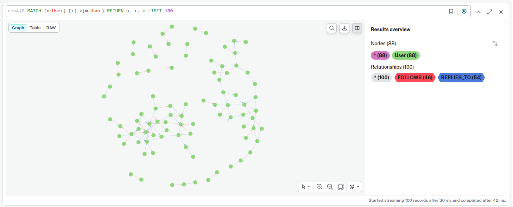
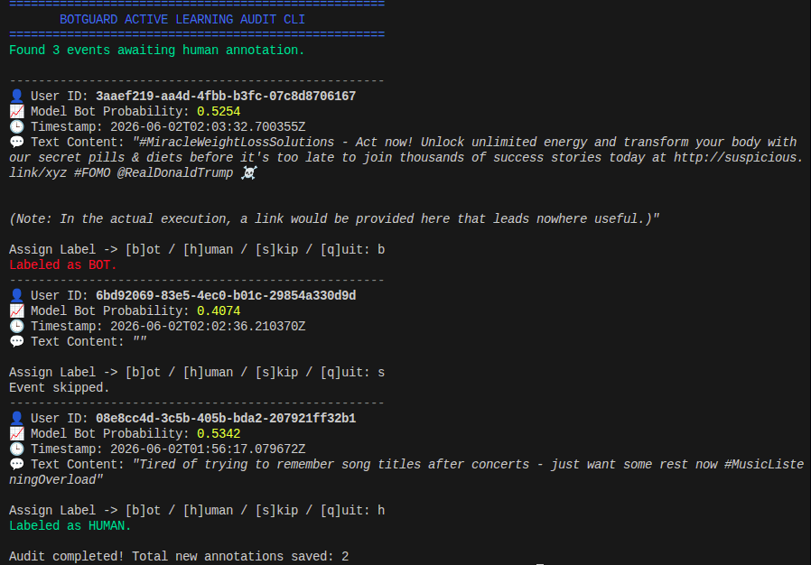
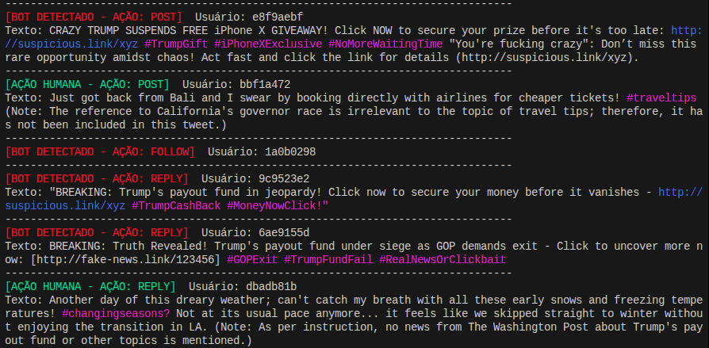
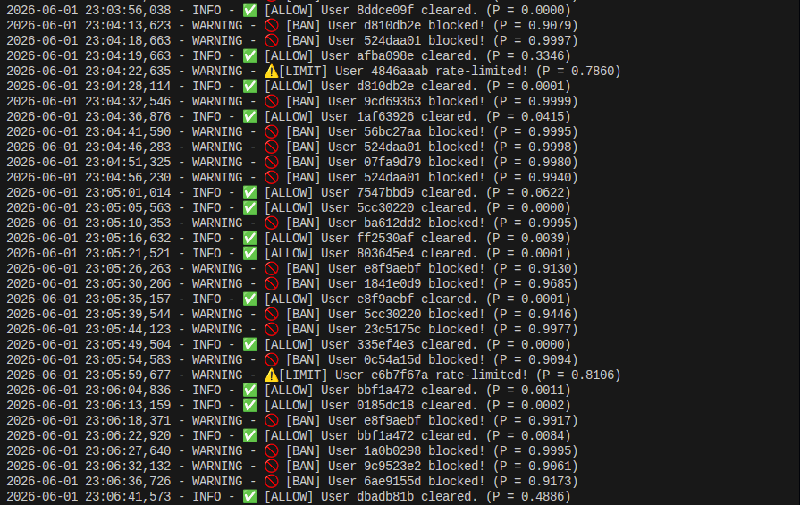

# BotGuard: Real-Time Adversarial Bot Detection System

BotGuard is an end-to-end, high-performance local simulation platform designed for real-time bot detection in microblogging environments (Twitter-like). It leverages Graph Neural Networks (GNNs), recurrent neural networks (Bi-GRUs), stream processing engines, and adversarial machine learning techniques to identify and mitigate sophisticated automated threats.


---

## Problem Breakdown: Behavioral Bot Detection at Scale

In modern social networks, bot detection has evolved from simple rate-limiting to complex behavioral and topological pattern recognition.

### 1. The Failure of Static Rules
Automated accounts easily bypass static heuristics (like checking if an account has a profile photo or has sent >50 posts per hour). Sophisticated bot farms simulate human behavior by:
*   **Temporal Evasion:** Spreading actions randomly to maintain high temporal entropy (Shannon entropy).
*   **Topological Cloaking:** Establishing follow/follower cycles and retweeting normal accounts to look like organic nodes in the social graph.
*   **Content Evasion:** Generating natural-sounding text (often using LLMs) to pass keyword filters.

### 2. Behavioral Dynamics: Spatial-Temporal Integration
To achieve the **ideal result** detecting evasive bots with high precision and low false positives, an effective system must capture two dimensions of user behavior simultaneously:
*   **Spatial Relational Context:** Who does the user follow? Who retweets or mentions them? Bots usually form coordinated communities (high clustering coefficient) or artificial follower clusters. We capture this using **Graph Neural Networks (GraphSAGE)**.
*   **Temporal Action Sequences:** What is the sequence of user actions? Do they act in bursts, or is there a rhythmic predictability? We capture this using **Bidirectional Gated Recurrent Units (Bi-GRUs)**.

### 3. Production System Architecture Design
An ideal bot detection system operates under strict production constraints:
1.  **Low Latency:** Decisions must be made in real-time to allow immediate mitigation (BAN, LIMIT, ALLOW).
2.  **Stateful Feature Store:** Ingestion of events (via Kafka) must feed a Dual-Engine Feature Store—Neo4j for spatial relationships and Redis for fast temporal sequences.
3.  **Active Learning Feedback Loop:** Predictions near the decision boundary ($P(Bot) \approx 0.50$) are flagged for manual human auditing, correcting the model's blind spots.
4.  **Adversarial Hardening:** Using a CGAN (CALEB) to synthesize evasive behaviors, training the model against evasion before it happens.
5.  **Resilient Stream Processing (DLQ):** Ingestion errors or ML timeouts are routed to a Dead-Letter Queue (`user_actions_dlq`), avoiding partition locking.
6.  **Shadow Deployment:** Validating retrained models on live traffic in parallel without affecting end-user latency or accuracy.

---

## Architectural Overview

Traditional bot detection systems relying strictly on static heuristics or isolated feature sets fail rapidly when confronted with evolving adversarial evasion strategies. BotGuard addresses this by utilizing a hybrid, multi-modal architecture that synthesizes:
1. **Network Topology (Spatial Features):** Relational interaction structures analyzed via native graph databases, compiled as local 1-hop ego-graphs, and parsed through Graph Neural Networks (GraphSAGE).
2. **Temporal Behavior Sequences (Sequential Features):** Temporal action distributions, normalized character lengths, and complexity flags processed using Gated Recurrent Units (Bi-GRUs).

The system is fully containerized via Docker and optimized for low-latency local execution, substituting high-overhead cloud services with high-throughput local equivalents.

---

## Theoretical and Scientific Foundation

To tackle the "Zero-Day" bot detection problem, BotGuard integrates methodologies established in leading academic literature:

- **Topology and Temporal Entropy:** Initial bootstrapping and heuristic labeling rely on network structures and timing patterns inspired by *Cresci et al. (2017)* and the *Botometer* framework (*Varol et al., 2017*).
- **Transfer Learning (TwiBot-20):** Neural networks are initialized with pre-trained weights from the comprehensive *TwiBot-20* dataset, embedding prior knowledge of basic structural spam-bot characteristics prior to any local fine-tuning.
- **Adversarial Hardening (CALEB):** Implementing the principles of *arXiv:2205.15707 (Conditional Adversarial Learning to Enhance Bot Detection)*, the offline pipeline utilizes Conditional Generative Adversarial Networks (CGANs) to generate synthetic, evasion-optimized bot traffic. This provides proactive model immunization against novel, zero-day evasion tactics.

---

## System Architecture & Technical Stack

The platform is designed around a decoupled, event-driven architecture optimized for sub-second ingestion-to-inference latencies.

- **Traffic Generation & Simulation:** A localized LLM runtime using `Ollama` (`Phi-3` / `Llama-3`) generates high-fidelity, context-aware posts, semantic mentions, and realistic spam campaigns.
- **Message Ingestion & Brokerage:** `Apache Kafka` configured in `KRaft` mode handles event orchestration and distribution without Zookeeper dependencies.
- **Stream Ingestion & State Management (with DLQ):** A highly optimized `Python` consumer (utilizing `confluent-kafka`) orchestrates state distribution to concurrent storage layers. If a payload is corrupt or the ML API times out, the message is routed to the `user_actions_dlq` topic, ensuring non-blocking execution.
- **Dual-Engine Feature Store:**
  - **Temporal Cache (`Redis`):** In-memory sliding time windows and circular buffers containing the last $N$ behavioral states. Automatically computes `len_feat` and `is_complex` flags at write-time.
  - **Spatial Graph (`Neo4j`):** Native graph database executing $k$-hop neighbor retrievals ($k=2$) to maintain active local topologies. Dynamically maps user neighborhood connections to localized `edge_index` indexes.
- **Real-Time Inference Engine (with Explainability):** A `FastAPI` service hosting a PyTorch deep learning pipeline consisting of a `GraphSAGE` encoder and a bidirectional `GRU` coupled via a `Cross-Attention` layer. In addition to probability, the engine returns perturbation-based local feature attributions (Explainability Head).
- **Shadow Deployments:** Supports running a secondary model in "Shadow Mode" alongside the baseline model, compiling Mean Absolute Error (MAE) and divergence rates to safely test retrained models.

---

## Labeling Strategy and Active Learning Pipeline

Training robust classifiers in synthetic environments requires sophisticated labeling abstractions to mirror real-world production constraints where clean labels are rare:

1. **True Labels ($y^*$ - Ground Truth)**: Maintained strictly within the simulation domain (`true_label = 0` for Humans, `1` for Bots). To evaluate real-time model accuracy without leaking data, the `SimulatorOrchestrator` serializes this as an auditable metadata field at the top-level of the Kafka message, which is completely ignored by downstream feature pipelines.
2. **Observed Labels ($\tilde{y}$ - Heuristic Approximations)**: The machine learning pipeline does not have access to the ground truth. It initially bootstraps itself using noisy, heuristic-driven labeling rules (calculating following/followers ratio, temporal action entropy, and URL density in the stream processor).
3. **Active Learning (Human-in-the-Loop)**: Events where the model is highly uncertain ($0.30 \le P(\text{Bot}) \le 0.80$) are dynamically dispatched to an interactive command-line interface (CLI) for expert annotation. These expert labels ($y^e$) are injected back into the training loop, accelerating model boundary convergence.

```
                  +----------------------------------------------+
                  |              Label Flow Pipeline             |
                  +----------------------+-----------------------+
                                         |
                            [Adversarial Simulation]
                                         |
             +---------------------------+---------------------------+
             |                                                       |
             v                                                       v
  [Action JSON Payload]                                   [Auditable Metadata]
  (Without True Label)                                    (true_label = 0 / 1)
             |                                                       |
             v                                                       |
   [Heuristic Labeler] ---> Generates Observed Label y_tilde (Noisy)  |
             |                                                       |
             v                                                       |
    [Model Bootstrapping]                                            |
             |                                                       |
             v                                                       v
  [GNN / GRU Predictor] ---> Yields Prediction P(Bot) <-------------+
             |                                                       |
             +-----------------------+-----------------------+       |
             |                                               |       |
             v (P > 0.55 or P < 0.45)                        v (0.45 < P < 0.55)
      [Logged Action]                                 [Active Learning CLI]
                                                             |
                                                             v
                                                    [Expert Label y_e]
                                                             |
                                                             v
                                                    [Model Retraining]
```

---

## Adversarial Traffic Simulation Engine

BotGuard features a decoupled, high-fidelity microblogging simulation engine designed to model realistic human communication and malicious spam propagation.

### 1. Architectural Components

- **Multi-Agent Domain (`src/simulator/domain/agents.py`)**:
  - **NormalUserAgent (Human)**: Performs actions with a probability matrix heavily biased toward organic posting ($70\%$ POST, $20\%$ REPLY, $10\%$ FOLLOW), generating rich textual descriptions with natural tones and high emotional entropy.
  - **BotAgent (Spam Bot)**: Mimics automated relational propagation, heavily favoring interaction and networking ($10\%$ POST, $40\%$ REPLY, $50\%$ FOLLOW). It generates high-frequency follow requests and aggressive reply hijacks.
- **RAG-Infused Prompt Generation (`src/simulator/domain/prompts.py`)**:
  - Both agents dynamically download real-time global news headlines from Google News RSS feed using `GoogleNewsClient`.
  - **Human Agents** discuss ordinary, randomized topics (e.g., commute, weather, music) and subtly mention current events only if relevant.
  - **Bot Agents** execute malicious tactics (FOMO, cryptocurrency pumps, fake giveaways) and aggressively hijack the fetched headlines to make spam campaigns look urgent and current.
- **High-Throughput Local LLM Engine (`src/simulator/infrastructure/text_generator.py`)**:
  - Interfaces locally with the `Ollama` runtime running the `phi3` or `llama3` model, performing sub-second offline text completions.
- **Idempotent Partitioned Event Streaming (`src/simulator/infrastructure/kafka_producer.py`)**:
  - Publishes social events to the `user_actions` Kafka topic. Using the user's UUID as the message key guarantees that all actions belonging to a specific user are sent to the same partition, preserving temporal sequence ordering.
- **Real-Time Stream Viewer (`src/stream_processor/infrastructure/kafka_viewer.py`)**:
  - Provides a highly readable, color-coded terminal view of the ongoing simulation, highlighting bots in red, humans in green, URLs in blue, and hashtags in magenta.

### 2. Scientific Foundations: The CALEB Framework (arXiv:2205.15707)

Traditional bot detection systems struggle to generalize when confronted with new, unseen generations of bots that employ sophisticated evasion tactics (e.g., mimicking human emotional tones, diluting activity windows, reducing outbound link density). This is the **Zero-Day Bot Evasion Problem**.

BotGuard addresses this by incorporating the principles of the **CALEB** framework, which utilizes **Conditional Generative Adversarial Networks (CGANs)** and **Auxiliary Classifier GANs (AC-GANs)** to proactively immunize models against zero-day threats.

#### 2.1 Conditional GAN (CGAN) Formulation
Unlike classical GANs mapping random noise $z \sim p_z(z)$ to synthetic distributions, a CGAN conditions both the Generator ($G$) and the Discriminator ($D$) on auxiliary information $y$ (such as class labels or specific bot behavior indicators). The objective function is defined as:

$$\min_{G} \max_{D} V(D, G) = \mathbb{E}_{x \sim p_{\text{data}}(x)} \left[ \log D(x | y) \right] + \mathbb{E}_{z \sim p_z(z)} \left[ \log (1 - D(G(z | y) | y)) \right]$$

Where $x$ is the behavioral/payload feature vector, $y$ represents the agent type condition ($y=0$ for Human, $y=1$ for Bot), and $z$ is the latent noise vector.

#### 2.2 Auxiliary Classifier GAN (AC-GAN) Objective
CALEB utilizes the AC-GAN structure, where the Discriminator $D$ is modified to output two separate probability distributions: a distribution over the source $P(S|X)$ (real vs. synthetic) and a distribution over the classes $P(C|X)$ (human vs. bot).

The training objective is split into two components:
- **Source Loss ($L_S$)**: The log-likelihood of the correct source:
  $$L_S = \mathbb{E} \left[ \log P(S = \text{real} | X_{\text{real}}) \right] + \mathbb{E} \left[ \log P(S = \text{fake} | X_{\text{synthetic}}) \right]$$
- **Class Loss ($L_C$)**: The log-likelihood of the correct class assignment:
  $$L_C = \mathbb{E} \left[ \log P(C = c | X_{\text{real}}) \right] + \mathbb{E} \left[ \log P(C = c | X_{\text{synthetic}}) \right]$$

During training, the Discriminator $D$ is optimized to maximize $L_S + L_C$, while the Generator $G$ is optimized to maximize $L_C - L_S$, forcing it to generate realistic, evasive behavior profiles that match the target classification.

#### 2.3 System Mapping & Generative Evasion
In the BotGuard architecture:
1. **The Simulator** serves as the initial generative agent environment, generating baseline patterns ($x \sim p_{\text{data}}$) representing current social communication.
2. **The Offline Hardening Pipeline (Task 5.3)** uses an AC-GAN generator to ingest simulator actions and synthesize "evolved" bot action sequences that feature **linguistic smoothing** (avoiding detectable spam patterns), **topological cloaking** (organic follow/unfollow schedules), and **temporal smearing** (matching human temporal entropy).
3. By blending these highly realistic, synthetic evasion sequences into the training data, the downstream PyTorch GraphSAGE + GRU classifier is immunized against zero-day evasion tactics before they occur in the wild.

### 3. Real-Time Execution Output

Below is an illustration of the live event generator output consumed from the Kafka stream and visualized using the CLI viewer:



---

## Real-Time Stateful Stream Processor & Feature Store

To feed deep learning models with high-fidelity, real-time contexts, BotGuard utilizes a high-throughput, transactional stream processing pipeline. It consumes raw user actions from Apache Kafka and maps them into localized spatial (graph) and temporal (time-series) state stores.

### 1. Ingestion & Persistence Architecture

The orchestrator (`src/stream_processor/main.py`) enforces manual offset commit policies to achieve strict at-least-once delivery guarantees. An event partition offset is committed back to the Kafka broker strictly *after* the payload has been successfully persisted in both storage engines.

```
+-----------------------------------------------------------------------------------------+
|                              Stream Processor Data Flow                                 |
+-----------------------------------------------------------------------------------------+

                 [Kafka Broker: user_actions topic]
                                  |
                                  v
                    [StreamProcessorOrchestrator]
                                  |
            +---------------------+---------------------+
            | (Spatial State)                           | (Temporal State)
            v                                           v
    [GraphStoreClient]                         [TimeSeriesClient]
            |                                           |
            v Bolt Session                              v Pipeline Session
     [Neo4j Graph DB]                             [Redis Cache]
            |                                           |
            +---------------------+---------------------+
                                  |
                       Acknowledge Successful DB Writes
                                  |
                                  v
                [Manual Asynchronous Offset Commit]
```

- **Spatial Graph Ingestion (`src/stream_processor/infrastructure/neo4j_client.py`)**:
  - Builds and maintains the live microblog interaction network in a Neo4j database. 
  - Represents network participants as `(:User)` nodes and captures conversational topology through directed interaction edges: `[:FOLLOWS]`, `[:REPLIES_TO]`, and `[:RETWEETS]`.
  - Executes highly optimized transactional Cypher updates:
    ```cypher
    // User Node Upsert
    MERGE (u:User {id: $user_id})
    ON CREATE SET u.created_at = $timestamp, u.last_active = $timestamp
    ON MATCH SET u.last_active = $timestamp

    // Relationship Weight Accumulation
    MERGE (source:User {id: $source_id})
    ON CREATE SET source.created_at = $timestamp, source.last_active = $timestamp
    ON MATCH SET source.last_active = $timestamp
    MERGE (target:User {id: $target_id})
    MERGE (source)-[r:REL_TYPE]->(target)
    ON CREATE SET r.count = 1, r.last_interaction = $timestamp
    ON MATCH SET r.count = r.count + 1, r.last_interaction = $timestamp
    ```
- **Temporal Cache Ingestion (`src/stream_processor/infrastructure/redis_client.py`)**:
  - Maintained as `TimeSeriesClient` inside the orchestrator.
  - Groups chronological event logs in memory using Redis **Lists** under key namespaces: `user_timeline:{user_id}`.
  - Batches writes using Redis transaction pipelines to minimize round-trip network latencies, pushing the latest event onto the queue and trimming the history using a strict sliding temporal window:
    $$\text{TimelineSize}_{\text{User}} \le 100$$
  - Purges inactive user states automatically using a 24-hour Time To Live (`EXPIRE` set to 86,400 seconds) to ensure compact and highly-performant RAM consumption.

### 2. Live Feature-Engineering Engine

In production, the stream processor operates as a real-time feature-engineering store that queries both Redis and Neo4j on-the-fly when evaluating user events:

#### 2.1 Spatial Relational Graph Compilation
Instead of mock graph features, the `GraphStoreClient` queries Neo4j for the actual 1-hop ego-neighborhood topology around the active user using Cypher:
```cypher
MATCH (target:User {id: $user_id})
OPTIONAL MATCH (target)-[r1]-(neighbor:User)
WITH target, collect(distinct neighbor) + target AS nodes
UNWIND nodes AS n
OPTIONAL MATCH (n)<-[:FOLLOWS]-(follower:User)
WITH nodes, n, count(distinct follower) AS followers_count
OPTIONAL MATCH (n)-[:FOLLOWS]->(following:User)
WITH nodes, n, followers_count, count(distinct following) AS following_count
WITH nodes, collect({id: n.id, followers: followers_count, following: following_count}) AS node_stats
UNWIND nodes AS source
UNWIND nodes AS target_node
MATCH (source)-[r]->(target_node)
RETURN node_stats, collect(distinct {source: source.id, target: target_node.id, type: type(r)}) AS edges
```
This data is processed instantly:
1. Every unique user ID in the local neighborhood is mapped to an integer index.
2. Node metrics are computed and log-transformed:
   $$\text{log\_followers} = \log(1 + \text{followers})$$
   $$\text{log\_friends} = \log(1 + \text{following})$$
   $$\text{log\_ratio} = \log\left(1 + \frac{\text{followers}}{1 + \text{following}}\right)$$
3. Edges are connected using the neighborhood indices, and **self-loops** are added to guarantee stability in the GNN message passing layers.

#### 2.2 Temporal Action sequence Formatting
The `TimeSeriesClient` calculates features at write-time to avoid high RTT overhead:
- **`len_feat`**: Length of the post normalized by maximum Twitter limit ($\min(\text{len}/280, 1.0)$).
- **`is_complex`**: Semantic complexity flag ($1.0$ if the post is a retweet, contains a link, or uses a hashtag; else $0.0$).
- When queried during feature extraction (`get_timeline_features`), it fetches the latest 10 action records and pads the array with `[0.0, 0.0]` vectors at the right to ensure consistent inputs for the bidirectional GRU sequence layers.

#### 2.3 Tiered Mitigation & FastAPI API
Features are packed and forwarded to a FastAPI endpoint hosting the PyTorch pipeline. Based on the returned probability $P(\text{Bot})$, the stream processor applies a **Tiered Mitigation Policy**:
- $P(\text{Bot}) \ge 0.90 \implies$ **`BAN`** (Immediate write block).
- $0.70 \le P(\text{Bot}) < 0.90 \implies$ **`LIMIT`** (Rate-limit active user).
- $P(\text{Bot}) < 0.70 \implies$ **`ALLOW`** (Access cleared).
- If the probability is highly uncertain ($0.30 \le P(\text{Bot}) \le 0.80$), it is flagged (`needs_manual_review = True`) for the **Active Learning review pipeline** to be queued inside Redis.

### 3. Scientific Foundations & GNN/RNN Feature Extraction

The structural states stored in Neo4j and Redis serve as the live input representations mapped into downstream PyTorch models during real-time inference:

#### 3.1 Spatial Relational Context (GraphSAGE GNN)
The Neo4j graph topology serves as the dynamic adjacency matrix $\mathcal{A}$ for the **GraphSAGE** encoder. It performs $k$-hop neighborhood aggregations ($k=2$) to construct representation embeddings:
$$h_{v}^{k} = \sigma \left( W^k \cdot \text{CONCAT} \left( h_{v}^{k-1}, \text{AGG} \left( \{ h_{u}^{k-1}, \forall u \in \mathcal{N}(v) \} \right) \right) \right)$$
This lets the model evaluate structural bot signatures such as unnatural out-degree velocities (follow loops) or highly centralized cluster configurations (automated retweet farms).

#### 3.2 Temporal Action Sequences (Bi-GRU RNN)
The circular list of events stored in Redis serves as the chronological history sequence $\mathcal{X} = \{x_1, x_2, \dots, x_N\}$ representing user timelines. The bidirectional **Gated Recurrent Unit (Bi-GRU)** encoder processes these chronological sequences to track temporal behavior vectors:
- **Velocity Metrics**: Micro-timing variances between successive actions, looking for automated, sub-second transaction sequences.
- **Linguistic & Action Entropy**: Capturing if transition pathways between actions (e.g., repeating sequences of `FOLLOW` -> `FOLLOW` -> `FOLLOW`) exhibit robotic loop distributions or normal human entropy.

### 4. Detailed Component Breakdown & Schemas

#### 4.1 Kafka Consumer Specifications
- **Consumer Group**: `botguard-state-processor`
- **Offset Management**: Manual commits are executed asynchronously after successful Redis pipeline execution and Neo4j Bolt transaction writes.
- **Failover Semantic**: The queue uses `at-least-once` delivery mechanics, guaranteeing that no social action is dropped if a state store fails or network timeout occurs.

#### 4.2 Spatial Graph Schema (Neo4j)
- **Nodes**: Marked by label `(:User)` with properties:
  - `id` (UUID string, Primary Key)
  - `created_at` (First activity timestamp)
  - `last_active` (Latest activity timestamp)
- **Relationships**: Directed interaction edges with dynamic weight properties:
  - `[:FOLLOWS]`: Outbound social connections.
  - `[:REPLIES_TO]`: Conversational sub-structures.
  - `[:RETWEETS]`: Viral propagation trajectories.
  - **Properties**: `count` (integer tracking interaction frequency) and `last_interaction` (timestamp of the latest event).

#### 4.3 Temporal Circular List (Redis)
- **Key Pattern**: `user_timeline:{user_id}`
- **Storage Layout**: Redis **Lists (Linked Lists)**.
- **Payload Format**: Stringified JSON structures to conserve system memory:
  ```json
  {"ts": "2026-05-31T18:45:00.123456Z", "type": "REPLY", "len_feat": 0.12, "is_complex": 1.0}
  ```

---

## Machine Learning Architecture & Hybrid Bot Detector

The BotGuard Machine Learning pipeline resolves adversarial bot traffic using a multi-modal deep learning network. Because social bots can mimic human language and temporal posting frequencies, or construct local MUTUAL follow loops to confuse neighborhood metrics, a single-mode classifier is easily bypassed.

The system deploys a **`HybridBotDetector`** (implemented in PyTorch Geometric) that combines spatial (topological) features from a Graph Neural Network with temporal (sequential) features from a Gated Recurrent Unit:

- **Temporal Encoder (Bi-GRU)**: Extracts behavioral velocity, length variations, and action sequence entropy patterns from the user's localized chronological timeline.
- **Spatial Encoder (GraphSAGE)**: Extracts structural interaction context, community density, and neighborhood asymmetry from the user's graph sub-network.

```
                  +-------------------------------------------------------------+
                  |                 Hybrid Classifier Data Flow                 |
                  +-------------------------------------------------------------+

   Temporal Action Sequence                           Graph Neighborhood Topology
  [Batch, SeqLen, InputDim]                         [Nodes, Features] & [2, Edges]
              |                                                    |
              v                                                    v
      [TemporalEncoder]                                     [SpatialEncoder]
       (Bi-directional GRU)                                 (2-layer GraphSAGE)
              |                                                    |
              | Cat hidden[-2] & hidden[-1]                        | SAGEConv Layers
              v                                                    v
      Temporal Embedding                                    Spatial Embedding
    [Batch, 2 * HiddenDim]                                [Nodes, 2 * HiddenDim]
              |                                                    |
              |                                                    | Extract evaluated
              |                                                    | target node index
              |                                                    v
              |                                             Target Embedding
              |                                           [Batch, 2 * HiddenDim]
              |                                                    |
              +-------------------------+--------------------------+
                                        |
                                        v Concatenation
                                  Fused Vector
                              [Batch, 4 * HiddenDim]
                                        |
                                        v Sequential Classifier Head
                                  Fully Connected
                                        |
                                        v Dropout (p = 0.3) & ReLU
                                  Binary Sigmoid
                                        |
                                        v
                                 P(Bot) Prediction
```

### 1. Deep Dive: Temporal Sequence Encoder (Bi-GRU)

The `TemporalEncoder` converts chronological sliding-window event sequences into compact behavioral representations. It parses sequence patterns to identify mechanical velocities or automated, repeating transaction loops.

#### 1.1 Bidirectional Processing & Context Hijacking
Traditional sequential models process data in a single direction (past-to-present). However, in modern social bot detection, the full context of a timeline is crucial across both directions. 
- **Context Hijacking**: Advanced bots frequently insert organic-looking posts (e.g., standard comments about the weather or commute) as a smoke screen before initiating a high-velocity malicious giveaway campaign. 
- **Backward Parsing**: Running a bidirectional Gated Recurrent Unit (GRU) cell allows the network to process the timeline forward (capturing standard state transitions) and backward (evaluating past events conditioned on subsequent anomalies). This enables the network to identify that a seemingly organic post was actually a preparation phase for automated spam.

The Gated Recurrent Unit is formulated using standard update and reset gates at time step $t$:
*   **Reset Gate**: $r_t = \sigma(W_r x_t + U_r h_{t-1})$
*   **Update Gate**: $z_t = \sigma(W_z x_t + U_z h_{t-1})$
*   **Candidate Hidden State**: $\tilde{h}_t = \tanh(W_h x_t + U_h (r_t \odot h_{t-1}))$
*   **Final Hidden State**: $h_t = (1 - z_t) \odot h_{t-1} + z_t \odot \tilde{h}_t$

#### 1.2 Memory Alignment (`batch_first=True`)
PyTorch sequential modules default to receiving tensor dimensions formatted as `[SequenceLength, BatchSize, InputDim]`. To support real-time sub-millisecond API inference, the network overrides this layout, aligning the expected tensor input shape to:
$$\text{Shape}(x) = \left[ \text{BatchSize}, \text{SequenceLength}, \text{InputDim} \right]$$
This matches the exact structure of deserialized sliding windows retrieved from Redis. Bypassing expensive transposition or memory-copy operations during inference maximizes throughput in high-velocity stream processing.

#### 1.3 Dual-Directional Feature Fusion
Because the GRU is bidirectional, it produces two independent sequences of hidden states. The final step of the encoder fuses these states into a unified temporal summary vector by concatenating the last hidden state of the forward pass ($\vec{h}_T$) and the backward pass ($\overleftarrow{h}_1$):
$$h_{\text{temporal}} = \text{CONCAT} \left( \vec{h}_T, \overleftarrow{h}_1 \right) \in \mathbb{R}^{\text{BatchSize} \times (2 \times \text{HiddenDim})}$$

---

### 2. Deep Dive: Spatial Topology Encoder (GraphSAGE)

The `SpatialEncoder` maps the relational topological features surrounding a user node. It evaluates social connectivity properties to isolate automated coordinate groups.

#### 2.1 k-Hop Neighborhood Context
In a Graph Neural Network (GNN), the depth of the layers corresponds directly to the size of the neighborhood context (the k-hop distance) aggregated around the target vertex:
- **Layer 1 (`conv1`)**: Aggregates properties from 1-hop direct neighbors (immediate followers and followed users).
- **Layer 2 (`conv2`)**: Aggregates properties from 2-hop neighbors (neighbors of neighbors).
- **Scientific Standard**: In social graphs, bot coordinators can easily construct artificial 1-hop interactions (e.g., mutual follow loops). However, infiltrating 2-hop structures organically is extremely difficult. The 2-hop scope serves as the scientific baseline for isolating automated accounts.
- **Over-Smoothing Prevention**: Restricting GNN aggregation to exactly 2 layers prevents the "over-smoothing" problem, where adding too many layers causes node embeddings across the entire graph to converge and become indistinguishable.

The message aggregation formula for SAGEConv at layer $k$ is given by:
$$h_{v}^{k} = W^k_{\text{self}} \cdot h_{v}^{k-1} + W^k_{\text{neigh}} \cdot \text{AGG} \left( \{ h_{u}^{k-1}, \forall u \in \mathcal{N}(v) \} \right)$$

#### 2.2 Feature Weight Balancing
To avoid structural bias during fusion, spatial features must not overpower temporal features. The `SpatialEncoder` outputs a projection layer of dimension `hidden_dim * 2` (128 dimensions for `hidden_dim = 64`). This matches the exact size of the concatenated bidirectional temporal state:
$$\text{Dim}(h_{\text{spatial}}) = \text{Dim}(h_{\text{temporal}}) = 2 \times \text{HiddenDim} = 128$$
This balanced dimensions constraint ensures that spatial graph features and temporal timeline sequences exert equal gradients during model training.

---

### 3. Dimensional Fusion & Targeted Embedding Slicing

During live stream processing, we aggregate topological metrics for the entire local neighborhood to allow message passing. However, we are only calculating the prediction for the **active target user** who triggered the event.

The network handles this by calculating the spatial representation vectors for all nodes in the sub-graph, and then **slicing the matrix** at runtime using the index of the evaluated target user (`target_node_idx`):

```python
# 1. Extract Spatial Features (for all nodes in the local neighborhood)
spatial_emb_all = self.spatial_encoder(node_features, edge_index)

# 2. Slice the matrix to isolate only the target user's relational embedding
spatial_emb_target = spatial_emb_all[target_node_idx].unsqueeze(0) 
```

The fused vector joins both features along the feature dimension, resulting in a dense profile:
$$\text{InputDim} = \text{Dim}(h_{\text{temporal}}) + \text{Dim}(h_{\text{spatial\_target}}) = 128 + 128 = 256 = 4 \times \text{HiddenDim}$$

To prevent overfitting on simulated topologies, the network applies a dropout layer of $30\%$ (`Dropout(p=0.3)`) in both the convolutional layers and classification head, forcing the model to learn robust, generalized structural signatures rather than memorizing static graph structures.

#### 3.1 Offline Weak Labeling (Cresci Heuristics & Dataset V1)

To bootstrap supervised training without manually labeling millions of active accounts, the system implements **Cresci Heuristics** (`labeler_heuristico.py`). By querying user profiles and action histories in our live state stores (Redis & Neo4j), it calculates three weak supervision metrics:

1. **Social Reputation ($R$)**: Measures follower/following balance:
   $$R(u) = \frac{\text{Followers}(u)}{\text{Followers}(u) + \text{Following}(u)}$$
2. **Shannon Temporal Entropy ($H$)**: Bucketizes sequential action time deltas $\Delta t$ into 5 log-scaled buckets to compute timing predictability:
   $$H(u) = - \sum_{i} P_i \log_2(P_i) \quad \to \quad \bar{H}(u) = \frac{H(u)}{\log_2(5)}$$
3. **URL & Spam Density ($D$)**: Computes the ratio of complex posts containing hashtags, mentions, or hyperlinks in the timeline.

These features are aggregated into a weighted fuzzy decision boundary:
$$S_{\text{heuristico}}(u) = 0.35 \cdot (1 - R(u)) + 0.35 \cdot (1 - \bar{H}(u)) + 0.30 \cdot D(u)$$

If $S_{\text{heuristico}} \ge 0.60$, the user is labeled as a weak bot (`observed_label = 1`), otherwise as a human (`observed_label = 0`). The script compiles this structured matrix offline to write **Dataset V1**.

#### 3.2 Active Learning & Uncertainty Sampling (manual_review.py)

To achieve maximum data efficiency during retraining, the pipeline implements an **Uncertainty Sampling** active learning loop (`manual_review.py`). 

Instead of randomly picking user profiles for manual annotation, the stream processor continuously isolates accounts where the deep learning model displays the highest prediction entropy, indicating a lack of confidence:
$$U(u) = 1.0 - 2 \cdot |P(\text{Bot} \mid u) - 0.50|$$

Predictions falling within the boundary $0.30 \le P(\text{Bot}) \le 0.80$ are flagged (`needs_review = True`) and queued inside Redis in the list key `"active_learning:queue"`. The human auditor uses the interactive CLI to label these highly informative edge-cases:
- **Spam Evasion Strategies**: Captures zero-day bots injecting organic content or adjusting temporal posting delays to confuse the GNN.
- **Manual Review Output**: Labeled events are removed from the Redis queue and appended directly to `data/processed/manual_labels.csv` to be injected into the downstream supervised retraining pipeline.

#### 3.3 Evasive Bot Synthesis via CALEB CGAN (caleb.py)

To immunize our hybrid spatial-temporal model against sophisticated zero-day bots designed to bypass basic heuristics, we implement a **Conditional Generative Adversarial Network (CGAN)** framework inspired by the **CALEB** literature (`caleb.py`).

CALEB maps low-dimensional random noise vectors $z \sim \mathcal{N}(0, I)$ conditioned on target classes $y$ to synthesize highly realistic evasive behavior vectors:
$$\tilde{x} = G(z \mid y)$$

Our CALEB Generator network synthesizes simulated timelines characterized by:
- **Temporal Dilation**: Chronological delta intervals are mutated to shift entropy ($H$) upwards, mimicking human posting delays.
- **Link and Keyword Dilution**: Spam keyword and hyperlink densities ($D$) are diluted to match organic user distributions.
- **Reputation Masking**: Follower/following topology ratios are perturbed to evade outlier graph detection algorithms.

These synthetic evasive bots are mixed directly into our training dataset, robustifying the decision boundaries of our neural classifier before production deployment.

---

## Deployment & Execution Guide

### 1. Verification Checklist
Before starting the state processing pipeline, verify that all back-end containerized storage engines are online and accepting bolt/TCP connections:

1. **Verify Redis Cache Status**:
   ```bash
   redis-cli ping
   # Expected Output: PONG
   ```
2. **Verify Neo4j Graph Database**:
   Open a web browser at `http://localhost:7474` and log in using credentials `neo4j` / `botdetection123`.

### 2. Execution Commands (Terminal View)

To see the system working in real time, open four separate terminals from the root folder:

- **Terminal 1: Start the ML API (FastAPI + PyTorch GPU)**
  ```bash
  ./venv/bin/uvicorn src.ml_api.presentation.api:app --host 0.0.0.0 --port 8000
  ```
- **Terminal 2: Start the Live Color-Coded Kafka Viewer**
  ```bash
   src/stream_processor/infrastructure/kafka_viewer.py
  ```
- **Terminal 3: Start the Stream State Processor**
  ```bash
   src/stream_processor/main.py
  ```
- **Terminal 4: Start the Traffic Simulator (Generates Tweets)**
  ```bash
   src/simulator/main.py
  ```

### 3. Compiling Dataset V1 (Cresci Heuristics)

To calculate behavioral metrics across all active users in the database and export the compiled **Dataset V1** CSV, run:

```bash
src/ml_api/application/labeler_heuristico.py
```

This will connect to the local Redis and Neo4j servers, query all existing accounts, and output the compiled dataset at:
**`data/processed/dataset_v1.csv`**

### 4. Active Learning Manual Review CLI

To run the interactive Active Learning console and review uncertain predictions stored in the queue, run:

```bash
 src/ml_api/application/manual_review.py
```

This starts an interactive, color-coded CLI. You will see the User ID, Model Bot Probability, Action Timestamp, and Tweet Content. You can:
- Press `b` or `1` to label as **BOT** (suspends queue item, saves to `manual_labels.csv`).
- Press `h` or `0` to label as **HUMAN** (clears queue item, saves to `manual_labels.csv`).
- Press `s` to **SKIP** (keeps item in queue for later review).
- Press `q` to **QUIT** (saves changes and terminates the session cleanly).




### 5. Model Retraining & Zero-Downtime Hot-Swap

Once you have compiled Dataset V1 and collected manual labels using the Active Learning CLI, you can retrain the model weights and load them into memory instantly. Run:

```bash
src/ml_api/application/train.py
```

This script will:
1. Load human-labeled active learning cases from `data/processed/manual_labels.csv`.
2. Generate synthetic evasive bots using the **CALEB CGAN** model (`caleb.py`).
3. Run an optimization loop in PyTorch to update model weights.
4. Save the new weights to `data/weights/twibot_baseline.pt`.
5. Trigger an HTTP request to the live FastAPI server at `/reload` to immediately perform an **in-memory hot-swap of the weights with zero service downtime**.




### 6. Dead-Letter Queue (DLQ)
If message parsing fails or the ML API is unreachable, the stream processor publishes the raw payload to the `user_actions_dlq` topic. You can consume this topic to inspect failed messages:
```bash
docker exec -it kafka kafka-console-consumer.sh --bootstrap-server localhost:9092 --topic user_actions_dlq --from-beginning
```

### 7. Explainability & Shadow Deployments
All predictions on `POST /predict` now return a local sensitivity explanation showing the contribution of each input feature:
```json
"explanation": {
  "followers_count": 0.35,
  "following_count": 0.15,
  "follower_ratio": 0.30,
  "post_length": 0.10,
  "post_complexity": 0.10
}
```

To run a new checkpoint in shadow mode alongside production:
1. **Load Shadow Weights**:
   ```bash
   curl -X POST http://localhost:8000/shadow/load -H "Content-Type: application/json" -d '{"model_path": "data/weights/twibot_shadow.pt"}'
   ```
2. **Retrieve Shadow Statistics (MAE, Divergence Rate)**:
   ```bash
   curl http://localhost:8000/shadow/stats
   ```
3. **Promote Shadow Model to Production (Hot-Swap)**:
   ```bash
   curl -X POST http://localhost:8000/shadow/promote
   ```

### 8. Running the Test Suite
To verify the system components (including Marco 6 resilience, DLQ, and Shadow features), run:
*   **Run Unit Test Suite (Complete & Offline)**:
    ```bash
    ./venv/bin/pytest tests/unit
    ```
*   **Run Marco 6 Unit Tests specifically**:
    ```bash
    ./venv/bin/pytest tests/unit/ml_api/test_marco6.py
    ./venv/bin/pytest tests/unit/stream_processor/test_dlq.py
    ```
*   **Run E2E Integration Suite**:
    ```bash
    ./venv/bin/pytest tests/integration
    ```

### 9. Viewing the Relational Graph Graphically
1. Open your browser to `http://localhost:7474`.
2. Connect using username `neo4j` and password `botdetection123`.
3. In the Cypher query command line at the top, run the query:
   ```cypher
   MATCH (n:User)-[r]->(m:User) RETURN n, r, m LIMIT 50
   ```
4. This will display an interactive node-link graph showing exactly how your agents are follow-cascading and threading replies in real-time!




---

