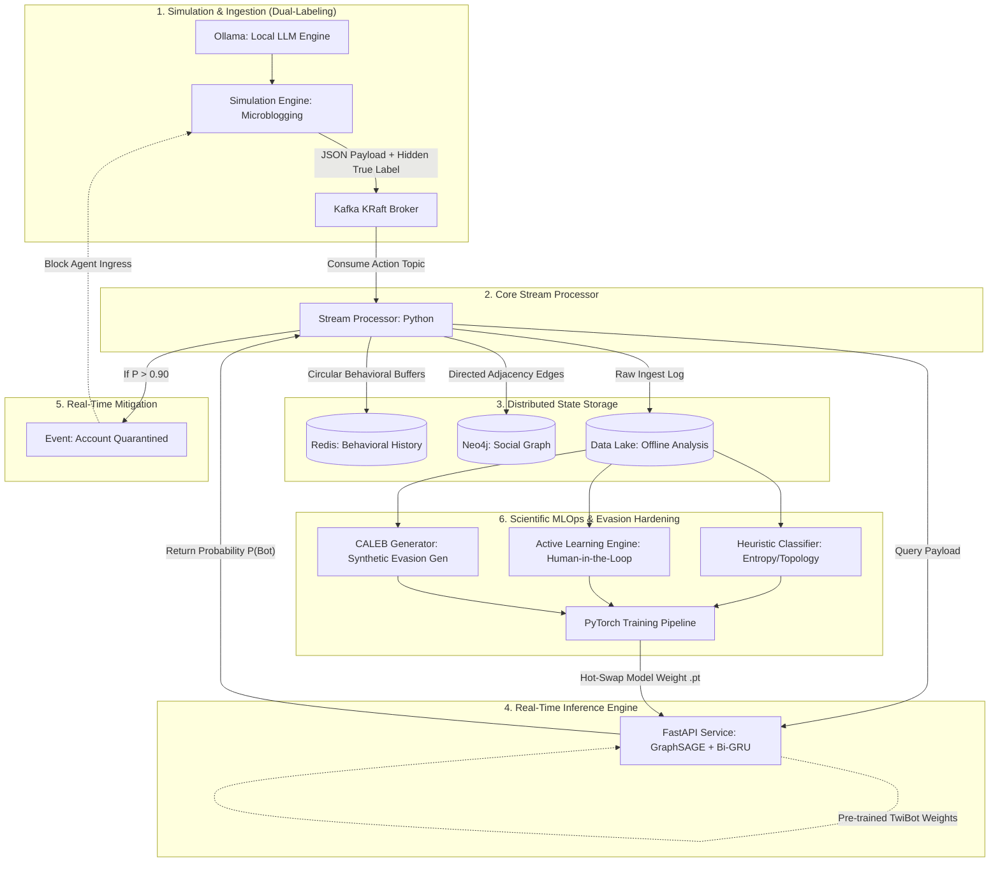

# Architecture Specification: Bot Detection System (Twitter Simulation)

**Date:** May 2026  
**Focus:** Adversarial Machine Learning, Directed Graph Topologies, Real-Time Stream Processing  
**Scientific Basis:** *Cresci et al. (2017)*, *Botometer (Varol et al., 2017)*, *CALEB (arXiv:2205.15707)*  
**Deployment Environment:** Local Peer-to-Peer Containerized Simulation (Docker)  

---

## 1. Architectural Design and Objectives

This system implements an end-to-end, high-throughput simulation of a microblogging social network. The primary architectural objective is to ingest real-time action events with sub-second latency and accurately classify malicious automated actors (bots). The classification engine utilizes a hybrid approach:
- **Spatial Topologies (Graph Structure):** Interaction maps detailing follow relationships, retweets, and mentions.
- **Temporal Action Sequences (Behavioral Dynamics):** The rhythm, sequence, and content patterns of a user's chronological activities.

To survive in highly adversarial environments where bot behavior constantly adapts to evade classification, the system decouples the **Online Critical Path** (ultra-low-latency real-time inference) from the **Offline MLOps Pipeline** (active learning, heuristic bootstrapping, and synthetic data augmentation).

---

## 2. Production-Grade Technology Stack

The infrastructure is designed using localized, high-performance open-source services to emulate production-scale cloud deployments locally.

| Ingestion/State Layer | Technology | Architectural Justification |
| :--- | :--- | :--- |
| **Data Generation** | Ollama (Phi-3 / Llama-3) | Local LLM execution engine to generate realistic linguistic variants, organic spam campaigns, and synthetic semantic mentions. |
| **Event Brokerage** | Apache Kafka (KRaft Mode) | High-throughput distributed log. Operating in KRaft mode eliminates Zookeeper overhead, simplifying localized orchestration. |
| **Stream Processing** | Python (`confluent-kafka`) | Real-time event consumption, micro-batching state updates, and coordinating asynchronous inference requests. |
| **Temporal State Cache** | Redis (In-Memory) | High-performance caching of sliding time windows, calculating transition matrices, and tracking the last $N$ behavioral states. |
| **Spatial Graph Database** | Neo4j (Native Graph) | Modifies and queries directed social graph representations. Optimized for fast $k$-hop subgraph extraction (typically $k=2$). |
| **Inference Runtime** | FastAPI + PyTorch | RESTful inference API pinning the deep learning models in memory for instantaneous scoring. |
| **Hybrid Deep Learning** | GraphSAGE + Bi-GRU | Dual-encoder network architecture: GraphSAGE encodes spatial local topologies; Bi-GRU extracts temporal sequences. |

---

## 3. Real-Time Online Data Pipeline

The lifecycle of an event is processed in milliseconds across the following execution stages:

1. **Simulation & Dual-Label Ingestion:** The simulation agent decides to initiate a bot or human action. It constructs a JSON event containing LLM-generated payloads, metadata (timestamps, action type), and a hidden ground-truth flag (`"true_label": "bot"`). The event is published to the `user_actions` Kafka topic.
2. **State Ingestion & Partitioning:** The *Stream Processor* consumes the event from Kafka and performs parallel updates:
   - **Graph Database (Neo4j):** Appends directed nodes and edge relationships (e.g., `(U1)-[:FOLLOWS]->(U2)`, `(U1)-[:MENTIONS]->(U3)`).
   - **In-Memory Cache (Redis):** Appends the timestamp and payload embeddings to a circular buffer mapped to the specific user.
3. **Feature Synthesis & Assembly:** The processor aggregates spatial features from Neo4j ($k$-hop adjacency) and temporal features from Redis, compiling a rich, multi-modal payload.
4. **Model Inference (Transfer Learning):** The compiled payload is transmitted via HTTP to the FastAPI inference server. The PyTorch service—pre-trained on the *TwiBot-20* benchmark dataset—processes the inputs. A *Cross-Attention* mechanism matches spatial and temporal vectors to compute the probability $P(\text{Bot})$.
5. **Real-Time Mitigation:** If the computed probability exceeds a defined threshold ($P(\text{Bot}) > 0.90$), the stream processor emits a ban event to the mitigation topic. The simulation engine consumes this event and immediately isolates/deactivates the offending agent.

---

## 4. Offline MLOps Pipeline and Adversarial Adaptation

Bot behaviors shift dynamically to evade detection. To counter this decay, the offline pipeline continuously refines the decision boundaries through three major paradigms.

### Paradigm 1: Heuristic Bootstrapping (Cresci / Botometer Principles)
Before the deep learning classifier achieves high confidence, a rules-based heuristic labeler operates on raw data lakes:
- **Temporal Entropy:** Extremely low variance in delta-times between actions, signaling scripted execution.
- **Structural Anomalies:** Highly disproportionate out-degree/in-degree ratios (following vs. followers).
- **Spam Densities:** Abnormally high ratios of external URLs and hyperlinked payloads in the user's timeline.
These heuristics generate the initial target variables (`observed_label`) for Dataset V1.

### Paradigm 2: Decision-Boundary Active Learning
To optimize human engineering efforts, the pipeline extracts events operating on the edge of classification certainty ($0.45 < P(\text{Bot}) < 0.55$). These ambiguous profiles are dispatched to an interactive CLI. Manual labeling of highly uncertain edge-cases dramatically accelerates network convergence and enhances decision-boundary precision.

### Paradigm 3: Proactive Defense via Synthetic Evasion (CALEB Framework)
Rather than waiting for new bot behaviors to degrade production performance, the pipeline proactively discovers vulnerabilities:
- A **Conditional GAN (CGAN)** is trained on existing bot footprints and human behavioral distributions.
- The generator produces synthetic bot profiles optimized to bypass GNN and GRU architectures (e.g., injecting natural delays, blending malicious links within organic conversational threads).
- The PyTorch neural networks are then re-trained on this augmented dataset, immunizing the system against advanced zero-day evasion tactics.

### Hot-Swap Model Deployment
Once training completes, the compiled model weights (`model_v2.pt`) are loaded into a secondary memory space within the FastAPI runtime. Traffic is dynamically routed to the new model without service interruption or message loss in Kafka.

---

## 5. Architectural Flow Diagram

