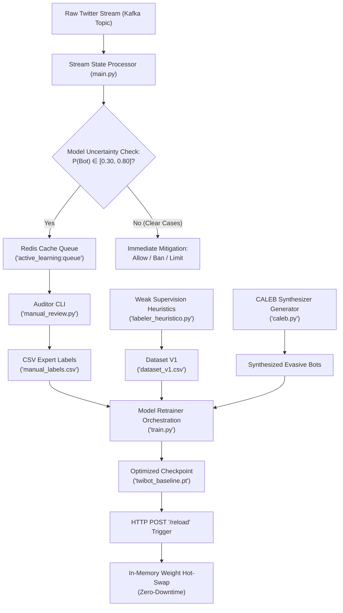

# 🧠 MLOps & Scientific Hybrid Pipeline: Technical Specification

This document details the scientific principles, mathematical formulations, and engineering implementations governing the **BotGuard MLOps Lifecycle** (Marco 5). 

---

## 1. MLOps Architectural Flow (Feedback Loop)

The MLOps pipeline represents a closed-loop system where automated weak supervision, active human auditing, and adversarial data generation continuously reinforce the spatial-temporal graph neural network.

---

## 2. Scientific & Mathematical Foundations

### 2.1 Weak Heuristic Supervision (Cresci et al. Literature)
To bootstrap a training dataset without relying on costly human annotations for millions of users, we implement a fuzzy weak labeler:
$$S_{\text{heuristico}}(u) = w_1 \cdot (1 - R(u)) + w_2 \cdot (1 - \bar{H}(u)) + w_3 \cdot D(u)$$
Where:
- **Social Reputation ($R(u)$)**: Ratio of followers to following.
- **Shannon Temporal Entropy ($\bar{H}(u)$)**: Metric of chronologically bucketed delay predictability.
- **URL/Spam Density ($D(u)$)**: Ratio of posts containing rich spam components.
- **Weights Configuration**: calibrated at $w_1 = 0.35, w_2 = 0.35, w_3 = 0.30$.

If $S_{\text{heuristico}}(u) \ge 0.60$, the node $u$ is weakly labeled as a bot (`observed_label = 1`).

---

### 2.2 Active Learning & Uncertainty Sampling
Instead of selecting user nodes at random for manual human auditing—which is statistically inefficient—the stream processor isolates edge cases where the baseline model’s classification entropy is highest:
$$U(u) = 1.0 - 2 \cdot |P(\text{Bot} \mid u) - 0.50|$$

Predictions falling within the boundary:
$$0.30 \le P(\text{Bot} \mid u) \le 0.80$$
are automatically routed to Redis. This captures samples that sit precisely along the model's decision boundary, maximizing the mathematical information value of each manual human label.

---

### 2.3 Evasive Bot Synthesis (CALEB Data Augmentation)
Sophisticated zero-day bots alter their behaviors (e.g., introducing posting delays or masking metadata) to evade standard thresholds. To counter this, we implement **CALEB (Conditional GAN)** data augmentation.

The Generator network $G(z \mid y)$ takes a random noise vector $z \sim \mathcal{N}(0, I)$ and conditions it on the class label $y = 1$ (Bot) to output synthetic behavior vectors:
$$\tilde{x} = G(z \mid y)$$

Our generator shifts features along two key dimensions:
1. **Entropy Dilation**: Expands the temporal spacing between actions, raising $\bar{H}(u)$ to mimic human randomness.
2. **Density Dilution**: Moderates the ratio of spam elements $D(u)$ to blend with organic text streams.

This forces the `HybridBotDetector` classifier to learn robust boundaries rather than memorizing static, historical bot structures.

---

## 3. Production engineering & Hot-Swap Mechanics

### 3.1 Retraining & Optimization Protocol
The model training script (`train.py`) aggregates:
*   $\mathcal{D}_{\text{weak}}$: Tabs from `dataset_v1.csv` ($S_{\text{heuristico}}$ weakly labeled).
*   $\mathcal{D}_{\text{expert}}$: High-confidence human reviews from `manual_labels.csv`.
*   $\mathcal{D}_{\text{synthetic}}$: Evasive profiles generated dynamically by CALEB.

It executes a supervised fine-tuning pass using PyTorch's `Adam` optimizer to adjust GNN convolutional layers and RNN sequence encoders.

---

### 3.2 Thread-Safe Zero-Downtime Hot-Swap
Traditional model redeployment requires spinning down web servers, leading to service disruption. BotGuard avoids this by executing a thread-safe, in-memory weight reload:

1.  **FastAPI Memory Binding**: The application binds an instance of `InferenceManager` globally.
2.  **State Load**: When a successful training run calls `/reload`, the system reads the serialized PyTorch dictionary (`.pt`) and maps the weights directly to the model layers using `.load_state_dict()`.
3.  **In-Memory Hot-Swap**: Since the network parameters are loaded in-place within the existing active class reference, the next incoming `/predict` request immediately utilizes the upgraded decision boundaries without restarting the process or terminating connections.

---

## 4. Marco 6: Large-Scale Resilience & Explainability

### 4.1 Dead-Letter Queue (DLQ)
Real-time stream processors must handle malformed payloads and downstream system timeouts without stopping the ingestion pipeline. 
If message parsing fails (`JSONDecodeError`) or the ML Inference API times out/fails, the orchestrator:
1. Catches the error to prevent blockages.
2. Formats a payload containing the raw message and the error stack trace.
3. Publishes this payload to the `user_actions_dlq` Kafka topic.
4. Commits the partition offset (`commit(asynchronous=True)`), permitting the stream loop to poll the next event immediately.

---

### 4.2 Perturbation-Based Explainability (Local Sensitivity)
To provide instant explanations for mitigation decisions (e.g., BAN/LIMIT) without the dependency overhead and latency of SHAP or LIME, we implement **Perturbation-Based Feature Attribution**:
Given model $f(X)$ and feature matrix $X = [x_1, \dots, x_M]$:
1. We run baseline prediction to get $f(X)$.
2. For each feature type $i$, we set $x_i = 0$ to get perturbed input $X^{(i)}$.
3. We run inference to get $f(X^{(i)})$.
4. The raw importance is:
   $$A_i = |f(X) - f(X^{(i)})|$$
5. Relative contribution $I_i$ is computed by normalizing the attributions:
   $$I_i = \frac{A_i}{\sum_j A_j}$$

This captures local sensitivity of the neural network outputs in sub-milliseconds.

---

### 4.3 Shadow Deployment & Verification
To validate a retrained model on live production traffic before making it the primary model, we run a **Shadow Mode** loop:
*   **Dual Inference**: When a model is loaded in shadow mode (`/shadow/load`), incoming `/predict` payloads are processed by both the production baseline model and the shadow model.
*   **Divergence Statistics**: The API tracks metrics in-memory using a thread-safe lock:
    *   **Mean Absolute Error (MAE)**: $\frac{1}{N}\sum |P_{\text{prod}} - P_{\text{shadow}}|$
    *   **Divergence Rate**: Frequency of mismatched mitigation actions (e.g. baseline decides `LIMIT` while shadow decides `BAN`).
*   **Stats API**: Stats are queried via `GET /shadow/stats`.
*   **Promotion**: If the metrics match expectations, `POST /shadow/promote` copies the shadow weights to baseline weights and completes the hot-swap.
