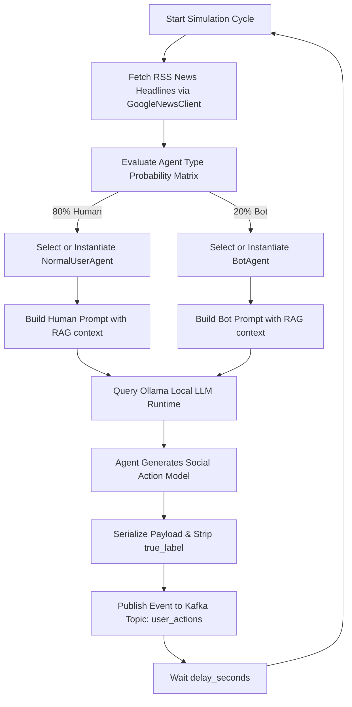

# 🤖 BotGuard Simulation Engine: Technical & Scientific Specifications

## 1. Architectural Design & System Flow

The BotGuard Simulation Engine is a high-fidelity, real-time adversarial traffic simulator designed to model social media environments (Twitter-like microblogs). It operates as an event generator, producing a continuous stream of heterogeneous social actions (posts, replies, follows) performed by both simulated humans and malicious spam bots.

The simulator utilizes a decoupled, event-driven architecture designed to feed a downstream stream-processing pipeline (managed by Redis, Neo4j, and Kafka) and a Graph Neural Network (GNN) inference service.

### 1.1 Ingestion and Execution Pipeline

The core execution flow is structured as a continuous loop governed by `SimulatorOrchestrator`. Below is the logical data flow:



---

## 2. Software Architecture & Component Breakdown

The simulator's codebase is divided into a Domain layer (containing agent behavior and prompt strategies) and an Infrastructure layer (handling external integrations, text generation, and stream publishing).

### 2.1 Domain Layer

#### 2.1.1 Base and Specialized Agents (`src/simulator/domain/agents.py`)
The system models network participants using an object-oriented paradigm. All simulated users inherit from `BaseAgent`, which encapsulates identity creation:

- **`BaseAgent`**: Automatically generates a unique, persistent RFC 4122 UUID v4 as `user_id`. It defines the contract `generate_action()`.
- **`NormalUserAgent`**: Simulates standard human behavior. It utilizes a probability distribution heavily weighted toward organic content generation and low interaction density:
  $$\text{ActionProbability}_{\text{Human}} = \begin{cases} \text{POST} & 70\% \\ \text{REPLY} & 20\% \\ \text{FOLLOW} & 10\% \end{cases}$$
  The domain marks all actions from this agent with a `true_label = 0`.
- **`BotAgent`**: Simulates automated malicious actors. Its action distribution favors aggressive networking and reply hijacking over original post creation:
  $$\text{ActionProbability}_{\text{Bot}} = \begin{cases} \text{POST} & 10\% \\ \text{REPLY} & 40\% \\ \text{FOLLOW} & 50\% \end{cases}$$
  The domain marks all actions from this agent with a `true_label = 1`.

#### 2.1.2 Dynamic Prompt Orchestration (`src/simulator/domain/prompts.py`)
To prevent LLM fatigue and generate highly varied linguistic patterns, prompts are compiled at runtime using combinatorial parameters:

- **Human Persona Matrix**: Combines randomly selected everyday topics (e.g., commute, coding bugs, weather, cooking, vacations) with distinct emotional tones (e.g., casual, tired, excited, thoughtful, complaining). This simulates high linguistic entropy.
- **Bot Persona Matrix**: Randomly selects a malicious payload topic (e.g., crypto pump-and-dumps, fake giveaways, phishing, miracle weight loss, pyramid schemes) and an aggressive psychological tactic (e.g., creating artificial urgency, triggering FOMO, sound too good to be true, aggressive capitalization).
- **RAG Integration**: Both human and bot prompt templates inject real-world context via a `news_context` parameter. Humans are instructed to mention the news subtly only if relevant, whereas bots are instructed to aggressively hijack current headlines to boost engagement and urgency.

---

### 2.2 Infrastructure Layer

#### 2.2.1 Real-Time News Retrieval (`src/simulator/infrastructure/news_client.py`)
The class `GoogleNewsClient` acts as a real-time Retrieval-Augmented Generation (RAG) source. It parses the global XML RSS feed from Google News:
- **Endpoint**: `https://news.google.com/rss`
- **Mechanism**: Issues HTTP GET requests with custom User-Agents, parses the response utilizing `xml.etree.ElementTree`, extracts the top five trending headlines, and flattens them into a single string pipeline (`"Headline 1 | Headline 2 | ..."`).
- **Fallback**: Gracefully degrades to a static string if network timeouts or parsing exceptions occur, ensuring simulation loop continuity.

#### 2.2.2 Local LLM Inference (`src/simulator/infrastructure/text_generator.py`)
The class `OllamaTextGenerator` interfaces with a local Ollama service:
- **Default Model**: `phi3` (or `llama3`)
- **Protocol**: REST API POST requests sent to `http://localhost:11434/api/generate` with disabled streaming (`"stream": false`) to minimize thread blockages.
- **Timeout Protection**: Enforces a strict 15-second network timeout to prevent slow generation cycles from freezing the event pipeline.

#### 2.2.3 Kafka Event Production (`src/simulator/infrastructure/kafka_producer.py`)
The class `EventProducer` uses `confluent_kafka` to manage high-throughput, low-latency message streaming:
- **Broker Configuration**: Connects to `localhost:9092`.
- **Reliability Parameters**:
  - `enable.idempotence = True`: Prevents message duplication.
  - `acks = all`: Guarantees acknowledgment from all in-sync replicas (ISR) before completing the transaction.
- **Partitioning Strategy**: Uses the agent's `user_id` as the message key. This guarantees that all chronological actions of a specific user are routed to the exact same Kafka partition, preserving absolute temporal ordering for down-stream state stores (like Redis and Neo4j).

---

## 3. Scientific Foundation: The CALEB Framework & Adversarial Bot Detection

To address the vulnerability of traditional bot detection models to "zero-day" or evolving bot strategies, the BotGuard architecture draws heavily from **arXiv:2205.15707**: *"CALEB: A Conditional Adversarial Learning Framework to Enhance Bot Detection"*.

### 3.1 The Evolving Social Bot Threat & Zero-Day Evasion

Standard machine learning classifiers (e.g., Random Forests, classic Deep Neural Networks) are trained on static historical datasets (e.g., Cresci-2017, TwiBot-20). Social bots, however, exhibit evolutionary dynamics to bypass detection policies. When developers modify bot behaviors to blend in with human characteristics (e.g., temporal smoothing, reducing hyperlink densities, mimicking human emotional tones), traditional classifiers suffer severe performance degradation. This is known as the **Zero-Day Bot Evasion Problem**.

### 3.2 Principles of Conditional Generative Adversarial Networks (CGAN)

The CALEB framework replaces passive classification with proactive adversarial training using **Conditional Generative Adversarial Networks (CGANs)**. Unlike traditional GANs that map arbitrary random noise $z \sim p_z(z)$ to synthetic distributions, a CGAN conditions both the Generator ($G$) and the Discriminator ($D$) on auxiliary information $y$ (such as class labels or specific bot behavior indicators).

The objective function of a Conditional GAN is defined as:

$$\min_{G} \max_{D} V(D, G) = \mathbb{E}_{x \sim p_{\text{data}}(x)} \left[ \log D(x | y) \right] + \mathbb{E}_{z \sim p_z(z)} \left[ \log (1 - D(G(z | y) | y)) \right]$$

Where:
- $x$ represents the actual vector of social network behaviors and payload features.
- $y$ is the conditional variable representing the specific class (e.g., $y=0$ for Human, $y=1$ for Bot, or multi-class categories representing bot types).
- $z$ is the input latent noise vector.
- $G(z | y)$ is the synthetic data generated by the Generator, conditioned on class $y$.
- $D(x | y)$ is the probability assigned by the Discriminator that $x$ is real data, conditioned on $y$.

---

### 3.3 Auxiliary Classifier GAN (AC-GAN) Architecture

CALEB expands on the standard CGAN architecture by utilizing an **Auxiliary Classifier GAN (AC-GAN)** structure. In an AC-GAN, every generated sample $X_{\text{fake}} = G(z|y)$ is associated with a class label $y \sim p_y$ alongside the standard noise $z$.

The Discriminator $D$ is modified to output two separate probability distributions:
1. $P(S | X)$: A probability distribution over the source of the data (real vs. fake/synthetic).
2. $P(C | X)$: A probability distribution over the class labels (e.g., Human vs. Bot).

```
                      +-------------------+
                      |   Noise Vector z  |
                      +---------+---------+
                                 |
                                 v
+------------------+  +-------------------+
|  Condition y     |->|    Generator G    |
+--------+---------+  +---------+---------+
         |                      |
         |                      v
         |            +-------------------+
         |            |  Synthetic Action |
         |            +---------+---------+
         |                      |
         +-------------+        |
                       |        |
                       v        v
+------------------+  +-------------------+
| Real Action x    |->|  Discriminator D  |
+------------------+  +---------+---------+
                                |
                   +------------+------------+
                   |                         |
                   v                         v
         +------------------+      +------------------+
         | Source Loss L_S  |      | Class Loss L_C   |
         | (Real vs. Fake)  |      | (Bot vs. Human)  |
         +------------------+      +------------------+
```

The loss function is split into two distinct components:

#### 3.3.1 Invariant Source Loss ($L_S$)
The log-likelihood of the correct source (real vs. synthetic):

$$L_S = \mathbb{E} \left[ \log P(S = \text{real} | X_{\text{real}}) \right] + \mathbb{E} \left[ \log P(S = \text{fake} | X_{\text{synthetic}}) \right]$$

#### 3.3.2 Conditional Class Loss ($L_C$)
The log-likelihood of the correct class assignment:

$$L_C = \mathbb{E} \left[ \log P(C = c | X_{\text{real}}) \right] + \mathbb{E} \left[ \log P(C = c | X_{\text{synthetic}}) \right]$$

#### 3.3.3 Objective Optimization
- **Discriminator Training**: The Discriminator $D$ is trained to maximize the joint objective:
  $$\text{Maximize } L_S + L_C$$
- **Generator Training**: The Generator $G$ is trained to maximize:
  $$\text{Maximize } L_C - L_S$$

This pushes the Generator to produce high-fidelity synthetic behavior that is indistinguishable from real data (minimizing $L_S$) while simultaneously being highly representative of the target class $c$ (maximizing $L_C$).

---

### 3.4 Mapping the Simulation Engine to CALEB Principles

In the context of the BotGuard ecosystem, the **Simulation Engine acts as the primary data generator** for the training environment. It mimics the behavior of a generative network by dynamically creating synthetic bot and human behaviors.

The integration occurs in two main phases:

#### 3.4.1 Phase 1: Real-time Ingestion & Baseline Generation (Current)
The simulator serves as an offline environment generator. Using local Large Language Models (LLMs) and probability distributions, it acts as an agent-based heuristic generator of realistic, contextual data. This acts as the baseline database ($x \sim p_{\text{data}}$) representing current social behaviors.

#### 3.4.2 Phase 2: Active Adversarial Hardening (Task 5.3)
To implement CALEB's proactive immunization, the system introduces a CGAN model that takes the active user-action representations generated by the simulator and attempts to synthesize "evolved" bot action sequences. These synthetic bot sequences incorporate typical evasive behaviors:
- **Linguistic Smoothing**: Modifying spam generation to avoid repetitive structures, reducing the likelihood of basic NLP detectors identifying bot patterns.
- **Topological Cloaking**: Interspersed follow-and-unfollow actions designed to mimic organic, reciprocal human networking behaviors.
- **Temporal Smearing**: Diluting rapid-fire bot actions with random delays to match human daily temporal entropy metrics.

By mixing these synthesized, highly evasive adversarial actions into the training dataset alongside real-world patterns, the downstream PyTorch GraphSAGE + GRU classifier is proactively immunized against zero-day bots before they are ever deployed in the live environment.

---

## 4. Behavioral Simulation Dynamics & Heuristics

The simulator relies on two structural vectors to model realistic social network activity: structural action frequencies (graph topology) and dynamic content generation (semantic profiles).

### 4.1 Topological and Action Frequencies

```
+-------------------------------------------------------------------+
|                        Action Probability                         |
+------------------------------------+------------------------------+
| Agent Type                         | POST  | REPLY | FOLLOW       |
+------------------------------------+-------+-------+--------------+
| Human (NormalUserAgent)            | 70%   | 20%   | 10%          |
| Bot (BotAgent)                     | 10%   | 40%   | 50%          |
+------------------------------------+-------+-------+--------------+
```

This tabular probability distribution creates highly distinctive topological profiles:
- **Human Profiles**: Characterized by isolated subgraphs with low edge-to-node ratios for `FOLLOW` actions. They generate dense text content through original `POST` actions.
- **Bot Profiles**: Characterized by high out-degree counts on the interaction graph (due to `FOLLOW` cascades) and recursive directed structures pointing to random targets (via `REPLY` actions).

This behavior mirrors the observations of **Cresci et al. (2017)** regarding the structural signatures of social bots, where bot subgraphs display highly uniform action sequences and unnatural outward connection counts compared to the power-law distributions seen in human subgraphs.

---

### 4.2 Semantic and Prompt Divergence

The linguistic style of generated text is controlled by separate prompt structures, creating distinct semantic footprints for ML models to learn from:

- **Human Semantic Profiles**: Focus on highly localized, variable, and mundane topics. Prompts restrict the usage of hashtags (`"Do not use hashtags. Write exactly as a normal person would."`). Tone indicators force the LLM to write with high grammatical variation. Real-world news is mentioned only if it fits the context naturally.
- **Bot Semantic Profiles**: Focus on high-urgency, financial, or malicious links. Prompts require the insertion of multiple hashtags and simulated malicious URLs (`"Use multiple hashtags and tell the user to click a link (simulate a link like http://suspicious.link/xyz)."`). The LLM is forced to perform event hijacking to link the spam campaign directly to trending headlines, mimicking real-world propagation strategies.

---

## 5. The Dual-Labeling Strategy & Ingestion Pipeline

To support the MLOps training lifecycle, the system implements a strict separation of concerns between absolute simulation data and the labels exposed to the machine learning pipeline.

### 5.1 True Labels vs. Observed Labels

A major challenge in bot detection is that true labels are rarely available in real-world production systems. Instead, downstream models must initially be bootstrapped using noisy heuristic labels, which are later refined via expert review.

The system manages three levels of labeling abstractions:

1. **True Labels ($y^*$ - Ground Truth)**: Created directly by the simulation engine (`true_label = 0` or `1`). This represents the absolute physical truth of the agent's identity.
2. **Observed Labels ($\tilde{y}$ - Heuristic Approximations)**: Generated by heuristic labeling tools (like `labeler_heuristico.py` in Task 5.1). These heuristics use standard structural calculations (e.g., following/followers ratio, temporal entropy, URL densities) to tag incoming events with a noisy label. The ML model is initially trained *only* on these observed labels.
3. **Expert Labels ($y^e$ - Human-in-the-loop)**: Collected when the model is highly uncertain ($P(\text{Bot}) \approx 0.50$). These events are dispatched to a manual review interface where human experts provide clean annotations. These expert labels are injected back into the training loop to refine the model's decision boundaries.

```
+------------------------------------------------------------------------------------------+
|                                  Label Flow Pipeline                                    |
+------------------------------------------------------------------------------------------+

  [Simulation Engine]
           |
           +----> Injects true_label (1/0) into Kafka (Auditable Metadata Only)
           |
           v
  [User Action JSON Payload] (Without true_label)
           |
           v
  [Stream Processor]
           |
           +----> [Heuristic Labeler] ----> Generates Observed Label y_tilde (Noisy)
           |                                       |
           |                                       v
           |                                [Model Bootstrapping]
           |                                       |
           v                                       v
  [Inference Service] -------------------> [GNN / GRU Classifier]
                                                   |
                                                   v
                                          Predicts P(Bot)
                                                   |
                           +------------------------+------------------------+
                           |                                                 |
                           v (High Confidence)                               v (Uncertainty: 0.45 < P < 0.55)
                    [Action Logged]                                   [Active Learning CLI]
                                                                             |
                                                                             v
                                                                    [Human Expert Label y_e]
                                                                             |
                                                                             v
                                                                    [Model Retraining]
```

---

### 5.2 Payload Schema & Serialization Details

When an agent executes an action, it generates a Pydantic `UserAction` model. 

#### 5.2.1 Pydantic Model Definition (`src/shared/domain/models.py`)
```python
class ActionType(str, Enum):
    POST = "POST"
    REPLY = "REPLY"
    RETWEET = "RETWEET"
    FOLLOW = "FOLLOW"

class UserAction(BaseModel):
    user_id: str
    target_id: Optional[str] = None
    action_type: ActionType
    content: Optional[str] = None
    timestamp: datetime = Field(default_factory=lambda: datetime.now(timezone.utc))
    true_label: int = Field(exclude=True)  # Excluded from standard JSON serialization
```

#### 5.2.2 Serialized Kafka Message Structure
To ensure that downstream models do not leak ground truth data, the `SimulatorOrchestrator` uses Pydantic's serialization filters to exclude `true_label` from the main payload, while appending it as a top-level auditable key strictly for performance evaluations:

```json
{
  "user_id": "8b5f3a09-64db-40a2-bc10-ef5c11d2e1c9",
  "target_id": "3c9a12e8-94fd-41fb-8b43-2287410c5da2",
  "action_type": "REPLY",
  "content": "Unbelievable news! Hijacking global headlines to tell you that you can win a free PS5 right now! Click here: http://suspicious.link/xyz #giveaway #free #breakingnews",
  "timestamp": "2026-05-31T18:45:00.123456Z",
  "true_label": 1
}
```

This structure allows downstream verification systems to compare the inference engine's real-time outputs ($P(\text{Bot})$) against the actual `true_label` without exposing the label to the feature processing pipeline.

---

## 6. Study & Execution Guide

### 6.1 Executing the Simulation Environment

To start the simulator, verify that the local infrastructure (Kafka, Redis, Neo4j) is running. Then, execute the entry point while ensuring that the root directory is included in Python's search path:

```bash
# From the project root (/home/midas/Documentos/AIRTON BRASIL/PROJETOS/botguard)
./venv/bin/python src/simulator/main.py
```

### 6.2 Running the Simulator Integration Test Suite

A complete Kafka integration test is available to verify the end-to-end event cycle, including local Ollama (Phi3) LLM text generation and payload validation:

```bash
# Run the simulator flow integration test
./venv/bin/pytest -s tests/integration/test_simulator_flow.py
```

This test will:
1. Initialize a temporary Kafka consumer subscribed to `user_actions` with a unique group.
2. Trigger one Orchestrator cycle, generating real RAG text from Google News headlines.
3. Assert that the generated message matches the exact `UserAction` serialization schema.

### 6.3 Key Verification Tasks for Study

1. **Verify Ingestion**: Run a terminal Kafka consumer to monitor the raw generated action stream:
   ```bash
   docker exec -it bot-detection-kafka kafka-console-consumer.sh \
     --bootstrap-server localhost:9092 \
     --topic user_actions \
     --from-beginning
   ```
2. **Observe Agent Drift**: Analyze how changing the weights in `src/simulator/domain/agents.py` impacts the topology of the interaction graph in Neo4j.
3. **Analyze Linguistic Entropy**: Compare the vocabulary distribution of generated posts between humans and bots. Notice how the bot prompts force lower linguistic entropy (due to repetitive spam structures and link references) compared to the human persona distributions.
