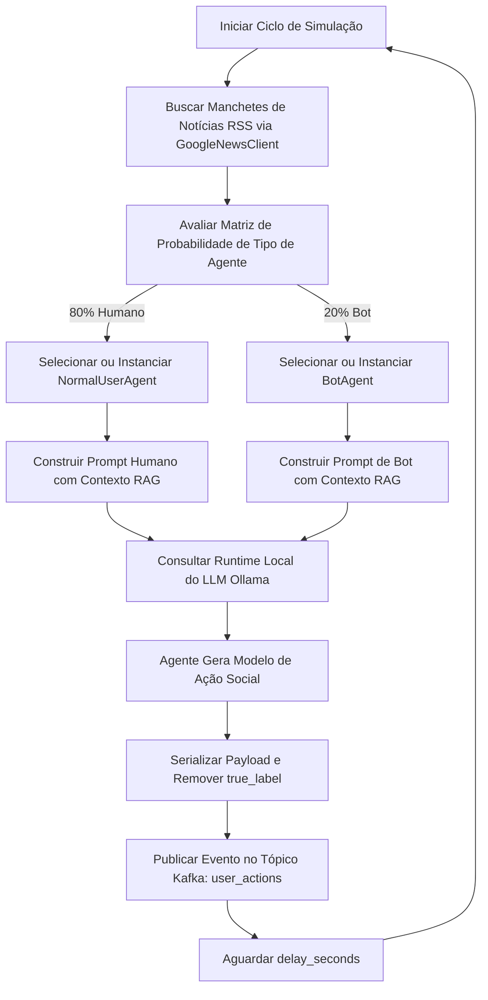

# 🤖 Motor de Simulação BotGuard: Especificações Técnicas e Científicas

## 1. Design Arquitetural e Fluxo do Sistema

O Motor de Simulação BotGuard é um simulador de tráfego adversarial de alta fidelidade e em tempo real, projetado para modelar ambientes de redes sociais (microblogs no estilo do Twitter). Ele funciona como um gerador de eventos, produzindo um fluxo contínuo de ações sociais heterogêneas (posts, replies, follows) realizadas tanto por humanos simulados quanto por bots de spam maliciosos.

O simulador utiliza uma arquitetura desacoplada e orientada a eventos, projetada para alimentar um pipeline de processamento de stream (gerenciado por Redis, Neo4j e Kafka) e um serviço de inferência baseado em Redes Neurais de Grafos (GNN).

### 1.1 Ingestão e Pipeline de Execução

O fluxo central de execução é estruturado como um loop contínuo governado pelo `SimulatorOrchestrator`. Abaixo está o fluxo lógico de dados:



---

## 2. Arquitetura de Software e Divisão de Componentes

A base de código do simulador é dividida em uma camada de Domínio (contendo o comportamento do agente e estratégias de prompt) e uma camada de Infraestrutura (lidando com integrações externas, geração de texto e publicação de streams).

### 2.1 Camada de Domínio

#### 2.1.1 Agentes Base e Especializados (`src/simulator/domain/agents.py`)
O sistema modela os participantes da rede usando um paradigma orientado a objetos. Todos os usuários simulados herdam de `BaseAgent`, que encapsula a criação de identidade:

- **`BaseAgent`**: Gera automaticamente um UUID v4 RFC 4122 único e persistente como `user_id`. Define o contrato `generate_action()`.
- **`NormalUserAgent`**: Simula o comportamento humano padrão. Utiliza uma distribuição de probabilidade fortemente ponderada para a geração de conteúdo orgânico e baixa densidade de interação:
  $$\text{ActionProbability}_{\text{Humano}} = \begin{cases} \text{POST} & 70\% \\ \text{REPLY} & 20\% \\ \text{FOLLOW} & 10\% \end{cases}$$
  O domínio marca todas as ações deste agente com `true_label = 0`.
- **`BotAgent`**: Simula atores maliciosos automatizados. Sua distribuição de ações favorece interações agressivas na rede e sequestro de respostas (reply hijacking) em vez da criação de posts originais:
  $$\text{ActionProbability}_{\text{Bot}} = \begin{cases} \text{POST} & 10\% \\ \text{REPLY} & 40\% \\ \text{FOLLOW} & 50\% \end{cases}$$
  O domínio marca todas as ações deste agente com `true_label = 1`.

#### 2.1.2 Orquestração Dinâmica de Prompts (`src/simulator/domain/prompts.py`)
Para evitar a fadiga do LLM e gerar padrões linguísticos altamente variados, os prompts são compilados em tempo de execução usando parâmetros combinatórios:

- **Matriz de Persona Humana**: Combina tópicos cotidianos selecionados aleatoriamente (ex: trânsito, bugs de código, clima, culinária, férias) com tons emocionais distintos (ex: casual, cansado, animado, reflexivo, reclamando). Isso simula uma alta entropia linguística.
- **Matriz de Persona de Bot**: Seleciona aleatoriamente um tópico de payload malicioso (ex: esquemas de pump-and-dump de cripto, sorteios falsos, phishing, perda de peso milagrosa, esquemas de pirâmide) e uma tática psicológica agressiva (ex: criar urgência artificial, gatilho de FOMO, soar bom demais para ser verdade, letras maiúsculas agressivas).
- **Integração RAG**: Ambos os templates de prompt de humanos e bots injetam contexto do mundo real através de um parâmetro `news_context`. Os humanos são instruídos a mencionar as notícias sutilmente apenas se for relevante, enquanto os bots são instruídos a sequestrar agressivamente as manchetes atuais para aumentar o engajamento e a urgência.

---

### 2.2 Camada de Infraestrutura

#### 2.2.1 Recuperação de Notícias em Tempo Real (`src/simulator/infrastructure/news_client.py`)
A classe `GoogleNewsClient` atua como uma fonte em tempo real para a Geração Aumentada por Recuperação (RAG). Ela faz o parsing do feed XML RSS global do Google News:
- **Endpoint**: `https://news.google.com/rss`
- **Mecanismo**: Envia requisições HTTP GET com User-Agents customizados, processa a resposta usando `xml.etree.ElementTree`, extrai as cinco principais manchetes do momento e as formata em uma única string contínua (`"Manchete 1 | Manchete 2 | ..."`).
- **Fallback**: Degrada graciosamente para uma string estática caso ocorram timeouts de rede ou exceções de parsing, garantindo a continuidade do ciclo de simulação.

#### 2.2.2 Inferência de LLM Local (`src/simulator/infrastructure/text_generator.py`)
A classe `OllamaTextGenerator` faz a interface com o serviço local do Ollama:
- **Modelo Padrão**: `phi3` (ou `llama3`)
- **Protocolo**: Requisições REST API POST enviadas para `http://localhost:11434/api/generate` com streaming desativado (`"stream": false`) para minimizar bloqueios de threads.
- **Proteção de Timeout**: Aplica um timeout estrito de rede de 15 segundos para evitar que ciclos de geração lentos congelem o pipeline de eventos.

#### 2.2.3 Produção de Eventos Kafka (`src/simulator/infrastructure/kafka_producer.py`)
A classe `EventProducer` usa `confluent_kafka` para gerenciar streaming de mensagens de alto throughput e baixa latência:
- **Configuração do Broker**: Conecta-se a `localhost:9092`.
- **Parâmetros de Confiabilidade**:
  - `enable.idempotence = True`: Evita a duplicação de mensagens.
  - `acks = all`: Garante a confirmação de todas as réplicas em sincronia (ISR) antes de completar a transação.
- **Estratégia de Particionamento**: Usa o `user_id` do agente como chave da mensagem. Isso garante que todas as ações cronológicas de um usuário específico sejam direcionadas para a mesma partição do Kafka, preservando a ordenação temporal absoluta para os bancos de dados downstream (como Redis e Neo4j).

---

## 3. Fundamentação Científica: O Framework CALEB e Detecção Adversarial de Bots

Para tratar a vulnerabilidade de modelos tradicionais de detecção de bots frente a estratégias de bots mutantes ou "zero-day", a arquitetura do BotGuard baseia-se fortemente no artigo **arXiv:2205.15707**: *"CALEB: A Conditional Adversarial Learning Framework to Enhance Bot Detection"*.

### 3.1 A Ameaça dos Bots Sociais Evolutivos e a Evasão Zero-Day

Classificadores de machine learning padrão (ex: Random Forests, Redes Neurais Profundas clássicas) são treinados em conjuntos de dados estáticos históricos (ex: Cresci-2017, TwiBot-20). Os bots sociais, no entanto, exibem dinâmicas evolutivas para contornar as políticas de detecção. Quando os desenvolvedores modificam o comportamento dos bots para misturar características humanas (ex: suavização temporal, redução de densidade de links, imitação de tons emocionais humanos), os classificadores tradicionais sofrem severa degradação de performance. Isso é conhecido como o **Problema de Evasão de Bots Zero-Day**.

### 3.2 Princípios de Redes Adversariais Geradoras Condicionais (CGAN)

O framework CALEB substitui a classificação passiva por um treinamento adversarial proativo usando **Redes Adversariais Geradoras Condicionais (CGANs)**. Diferente de GANs tradicionais que mapeiam ruído aleatório $z \sim p_z(z)$ para distribuições sintéticas, uma CGAN condiciona tanto o Gerador ($G$) quanto o Discriminador ($D$) a informações auxiliares $y$ (como rótulos de classe ou indicadores de comportamento de bot específicos).

A função objetivo de uma GAN Condicional é definida como:

$$\min_{G} \max_{D} V(D, G) = \mathbb{E}_{x \sim p_{\text{data}}(x)} \left[ \log D(x | y) \right] + \mathbb{E}_{z \sim p_z(z)} \left[ \log (1 - D(G(z | y) | y)) \right]$$

Onde:
- $x$ representa o vetor real de comportamentos de rede social e características de payload.
- $y$ é a variável condicional que representa a classe específica (ex: $y=0$ para Humano, $y=1$ para Bot, ou categorias multiclasse representando tipos de bots).
- $z$ é o vetor de ruído latente de entrada.
- $G(z | y)$ são os dados sintéticos gerados pelo Gerador, condicionados à classe $y.
- $D(x | y)$ é a probabilidade atribuída pelo Discriminador de que $x$ seja um dado real, condicionado a $y$.

---

### 3.3 Arquitetura Auxiliary Classifier GAN (AC-GAN)

O CALEB expande a arquitetura CGAN padrão utilizando uma estrutura de **GAN com Classificador Auxiliar (AC-GAN)**. Em uma AC-GAN, cada amostra gerada $X_{\text{fake}} = G(z|y)$ é associada a um rótulo de classe $y \sim p_y$ juntamente com o ruído padrão $z$.

O Discriminador $D$ é modificado para fornecer duas distribuições de probabilidade distintas:
1. $P(S | X)$: Uma distribuição de probabilidade sobre a fonte dos dados (real vs. fake/sintético).
2. $P(C | X)$: Uma distribuição de probabilidade sobre os rótulos das classes (ex: Humano vs. Bot).

```
                      +-------------------+
                      |   Vetor de Ruído z|
                      +---------+---------+
                                 |
                                 v
+------------------+  +-------------------+
|  Condição y      |->|    Gerador G      |
+--------+---------+  +---------+---------+
         |                      |
         |                      v
         |            +-------------------+
         |            |   Ação Sintética  |
         |            +---------+---------+
         |                      |
         +-------------+        |
                       |        |
                       v        v
+------------------+  +-------------------+
| Ação Real x      |->|  Discriminador D  |
+------------------+  +---------+---------+
                                |
                   +------------+------------+
                   |                         |
                   v                         v
         +------------------+      +------------------+
         | Perda de Fonte L_S|      | Perda de Classe L_C|
         |  (Real vs. Fake)  |      | (Bot vs. Humano)  |
         +------------------+      +------------------+
```

A função de perda é dividida em dois componentes distintos:

#### 3.3.1 Perda de Fonte Invariante ($L_S$)
A log-verossimilhança da fonte correta (real vs. sintético):

$$L_S = \mathbb{E} \left[ \log P(S = \text{real} | X_{\text{real}}) \right] + \mathbb{E} \left[ \log P(S = \text{fake} | X_{\text{sintético}}) \right]$$

#### 3.3.2 Perda de Classe Condicional ($L_C$)
A log-verossimilhança da atribuição correta de classe:

$$L_C = \mathbb{E} \left[ \log P(C = c | X_{\text{real}}) \right] + \mathbb{E} \left[ \log P(C = c | X_{\text{sintético}}) \right]$$

#### 3.3.3 Otimização do Objetivo
- **Treinamento do Discriminador**: O Discriminador $D$ é treinado para maximizar o objetivo conjunto:
  $$\text{Maximizar } L_S + L_C$$
- **Treinamento do Gerador**: O Gerador $G$ é treinado para maximizar:
  $$\text{Maximizar } L_C - L_S$$

Isso força o Gerador a produzir comportamentos sintéticos de alta fidelidade que são indistinguíveis dos dados reais (minimizando $L_S$), enquanto, ao mesmo tempo, são altamente representativos da classe alvo $c$ (maximizando $L_C$).

---

### 3.4 Mapeando o Motor de Simulação aos Princípios CALEB

No contexto do ecossistema BotGuard, o **Motor de Simulação atua como o principal gerador de dados** para o ambiente de treinamento. Ele imita o comportamento de uma rede geradora, criando dinamicamente comportamentos sintéticos de humanos e bots.

A integração ocorre em duas fases principais:

#### 3.4.1 Fase 1: Ingestão em Tempo Real e Geração de Linha de Base (Atual)
O simulador serve como um gerador de ambiente offline. Usando Modelos de Linguagem Grandes locais (LLMs) e distribuições de probabilidade, ele funciona como um gerador heurístico baseado em agentes de dados realistas e contextuais. Isso forma a base de dados inicial ($x \sim p_{\text{data}}$) representando comportamentos sociais vigentes.

#### 3.4.2 Fase 2: Endurecimento Adversarial Ativo (Tarefa 5.3)
Para implementar a imunização proativa do CALEB, o sistema introduz um modelo CGAN que pega as representações de ações ativas do usuário geradas pelo simulador e tenta sintetizar sequências de ações de bots "evoluídos". Essas sequências de bots sintéticos incorporam comportamentos típicos de evasão:
- **Suavização Linguística**: Modificação da geração de spam para evitar estruturas repetitivas, reduzindo a probabilidade de detecção por NLP básico.
- **Mascaramento Topológico**: Ações intercaladas de seguir e desseguir, projetadas para imitar interações orgânicas e recíprocas humanas.
- **Diluição Temporal**: Diluição de ações rápidas de bots com intervalos aleatórios para corresponder às métricas humanas de entropia temporal diária.

Ao misturar essas ações adversariais sintetizadas e altamente evasivas no dataset de treinamento com os padrões reais, o classificador downstream PyTorch GraphSAGE + GRU é imunizado proativamente contra bots mutantes antes que eles sejam implantados em ambiente de produção real.

---

## 4. Dinâmicas de Simulação Comportamental e Heurísticas

O simulador baseia-se em dois vetores estruturais para modelar atividades de redes sociais de forma realista: frequências de ações estruturais (topologia de grafo) e geração de conteúdo dinâmico (perfis semânticos).

### 4.1 Frequências de Ações e Topologia

```
+-------------------------------------------------------------------+
|                     Probabilidade de Ações                        |
+------------------------------------+------------------------------+
| Tipo de Agente                     | POST  | REPLY | FOLLOW       |
+------------------------------------+-------+-------+--------------+
| Humano (NormalUserAgent)           | 70%   | 20%   | 10%          |
| Bot (BotAgent)                     | 10%   | 40%   | 50%          |
+------------------------------------+-------+-------+--------------+
```

Esta distribuição de probabilidade gera perfis topológicos altamente característicos:
- **Perfis Humanos**: Caracterizados por subgrafos isolados com baixas razões de arestas por nós em ações `FOLLOW`. Eles produzem conteúdo de texto denso por meio de posts originais (`POST`).
- **Perfis de Bots**: Caracterizados por alta quantidade de conexões de saída (out-degree) no grafo de interações (devido a cascatas de `FOLLOW`) e estruturas direcionadas recursivas apontando para alvos aleatórios (via ações `REPLY`).

Esse comportamento reflete as observações de **Cresci et al. (2017)** sobre assinaturas estruturais de bots sociais, onde subgrafos de bots exibem sequências de ações muito uniformes e contagens de conexões externas não naturais se comparadas às distribuições em lei de potência vistas nos subgrafos humanos.

---

### 4.2 Divergência Semântica e de Prompts

O estilo linguístico do texto gerado é controlado por prompts distintos, criando perfis semânticos marcantes para os modelos de aprendizado:

- **Perfis Semânticos Humanos**: Focam em tópicos cotidianos, mundanos e altamente variáveis. Os prompts restringem o uso de hashtags (`"Não use hashtags. Escreva exatamente como uma pessoa normal escreveria."`). Indicadores de tom emocional forçam o LLM a escrever com alta variação gramatical. Notícias reais do mundo são mencionadas sutilmente apenas se fizerem sentido ao contexto.
- **Perfis Semânticos de Bots**: Focam em mensagens financeiras urgentes, promoções ou links maliciosos. Os prompts exigem a inclusão de múltiplas hashtags e URLs simuladas (`"Use múltiplas hashtags e diga ao usuário para clicar em um link (simule um link como http://suspicious.link/xyz)."`). O LLM é forçado a fazer sequestro de assuntos (event hijacking) para associar as campanhas de spam diretamente às manchetes de notícias do momento, imitando estratégias reais de propagação.

---

## 5. Estratégia de Dupla Rotulagem e Ingestão

Para dar suporte ao ciclo de vida de treinamento MLOps, o sistema aplica uma estrita separação de conceitos entre os dados brutos de simulação e os rótulos expostos ao pipeline de aprendizado de máquina.

### 5.1 Rótulos Reais (True Labels) vs. Rótulos Observados (Observed Labels)

Um grande desafio na detecção de bots é que rótulos reais raramente estão disponíveis em sistemas reais de produção. Em vez disso, os modelos downstream precisam ser inicialmente inicializados com rótulos heurísticos ruidosos, que são refinados posteriormente via revisão de especialistas.

O sistema gerencia três níveis de rotulagem:

1. **Rótulos Reais ($y^*$ - Ground Truth)**: Criados diretamente pelo motor de simulação (`true_label = 0` ou `1`). Representa a identidade real física do agente.
2. **Rótulos Observados ($\tilde{y}$ - Heuristic Approximations)**: Gerados pelas ferramentas de rotulagem heurística (como `labeler_heuristico.py` na Tarefa 5.1). Essas heurísticas usam cálculos estruturais clássicos (ex: proporção seguidores/seguindo, entropia temporal, densidade de URLs) para rotular os eventos recebidos. O modelo de ML é inicialmente treinado *apenas* com esses rótulos observados.
3. **Rótulos Especialistas ($y^e$ - Human-in-the-loop)**: Coletados quando o modelo se mostra altamente incerto ($P(\text{Bot}) \approx 0.50$). Esses eventos são enviados para uma interface de revisão onde especialistas humanos provêm anotações limpas. Esses rótulos limpos alimentam o loop de retreinamento para ajustar as fronteiras de decisão do modelo.

```
+------------------------------------------------------------------------------------------+
|                              Pipeline de Fluxo de Rótulos                                |
+------------------------------------------------------------------------------------------+

  [Motor de Simulação]
           |
           +----> Injeta true_label (1/0) no Kafka (Apenas Metadados de Auditoria)
           |
           v
  [Payload JSON da Ação do Usuário] (Sem true_label)
           |
           v
  [Processador de Stream]
           |
           +----> [Rotulador Heurístico] ----> Gera Rótulo Observado y_tilde (Ruidoso)
           |                                       |
           |                                       v
           |                                [Bootstrapping do Modelo]
           |                                       |
           v                                       v
  [Serviço de Inferência] ----------------> [Classificador GNN / GRU]
                                                   |
                                                   v
                                          Prevê P(Bot)
                                                   |
                           +------------------------+------------------------+
                           |                                                 |
                           v (Alta Confiança)                                v (Incerteza: 0.45 < P < 0.55)
                    [Ação Registrada]                                 [CLI de Active Learning]
                                                                             |
                                                                             v
                                                                    [Rótulo Humano y_e]
                                                                             |
                                                                             v
                                                                    [Retreinamento]
```

---

### 5.2 Esquema do Payload e Detalhes de Serialização

Sempre que um agente executa uma ação, ele gera um modelo Pydantic `UserAction`.

#### 5.2.1 Definição do Modelo Pydantic (`src/shared/domain/models.py`)
```python
class ActionType(str, Enum):
    POST = "POST"
    REPLY = "REPLY"
    RETWEET = "RETWEET"
    FOLLOW = "FOLLOW"

class UserAction(BaseModel):
    user_id: str
    target_id: Optional[str] = None
    action_type: ActionType
    content: Optional[str] = None
    timestamp: datetime = Field(default_factory=lambda: datetime.now(timezone.utc))
    true_label: int = Field(exclude=True)  # Excluído da serialização padrão JSON
```

#### 5.2.2 Estrutura da Mensagem Serializada do Kafka
Para garantir que os modelos de ML não vazem informações de ground truth na rede de features, o `SimulatorOrchestrator` utiliza filtros de serialização do Pydantic para excluir o `true_label` do payload principal da ação, enquanto o anexa como uma chave auditável no topo do JSON exclusivamente para fins de avaliação de métricas offline:

```json
{
  "user_id": "8b5f3a09-64db-40a2-bc10-ef5c11d2e1c9",
  "target_id": "3c9a12e8-94fd-41fb-8b43-2287410c5da2",
  "action_type": "REPLY",
  "content": "Unbelievable news! Hijacking global headlines to tell you that you can win a free PS5 right now! Click here: http://suspicious.link/xyz #giveaway #free #breakingnews",
  "timestamp": "2026-05-31T18:45:00.123456Z",
  "true_label": 1
}
```

Essa modelagem permite que sistemas downstream comparem as predições em tempo real do motor de inferência ($P(\text{Bot})$) diretamente com a verdade física (`true_label`) sem que essa etiqueta interfira nas variáveis de feature do modelo.

---

## 6. Guia de Estudos e Execução

### 6.1 Executando o Ambiente de Simulação

Para iniciar a simulação contínua, verifique se todos os serviços (Kafka, Redis, Neo4j) estão operacionais e execute o script na raiz do repositório:

```bash
# Executado a partir do diretório raiz (/home/midas/Documentos/AIRTON BRASIL/PROJETOS/botguard)
./venv/bin/python src/simulator/main.py
```

### 6.2 Executando a Bateria de Testes de Integração do Simulador

Uma suíte de testes de integração do Kafka está disponível para validar fisicamente o ciclo contínuo, incluindo a geração semântica de notícias RAG e o envio do evento ao Kafka:

```bash
# Executa o teste de fluxo do simulador
./venv/bin/pytest -s tests/integration/test_simulator_flow.py
```

Esse teste irá:
1. Instanciar um consumidor temporário assinado no tópico `user_actions` com um grupo único.
2. Disparar um ciclo completo do orquestrador (gerando texto realista sobre as manchetes atuais via Ollama).
3. Confirmar que a mensagem recebida atende perfeitamente ao formato esperado pelo esquema serializado `UserAction`.

### 6.3 Tópicos Principais para Estudo e Auditoria

1. **Auditar Mensagens Kafka**: Inicie um consumidor padrão no terminal para visualizar o fluxo gerado em tempo real:
   ```bash
   docker exec -it bot-detection-kafka kafka-console-consumer.sh \
     --bootstrap-server localhost:9092 \
     --topic user_actions \
     --from-beginning
   ```
2. **Observar Deriva Topológica**: Tente modificar os pesos e frequências de ações em `src/simulator/domain/agents.py` e veja o reflexo imediato no Neo4j.
3. **Avaliar Entropia Linguística**: Compare a riqueza de termos gerados por humanos e bots. Observe que os robôs geram baixa entropia vocabular por focarem em links promocionais repetitivos, enquanto os perfis humanos se dispersam nas mais diversas temáticas cotidianas.
