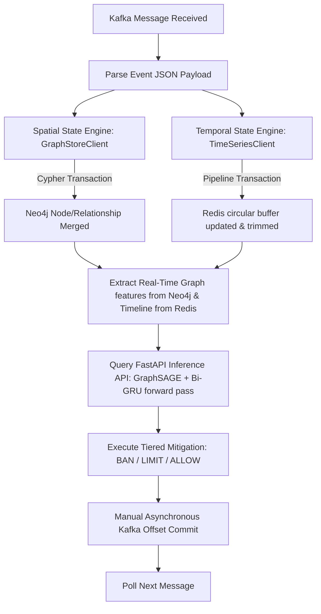

# ⚙️ BotGuard Stream Processor: Technical Specifications

## 1. Architectural Overview & Stateful Ingestion

The BotGuard Stream Processor is a high-throughput, low-latency state synchronization and feature-engineering service. It operates as the intermediate pipeline that translates raw microblogging events (ingested in real time from Apache Kafka) into high-performance structural states, and extracts logical features for deep learning inference.

To enable multi-modal machine learning classification (Graph Neural Networks combined with Sequential Models), the stream processor concurrently maintains and queries two distinct representations of the system's state:

1. **Spatial Graph Topology (Neo4j)**: Represents relational interaction metrics (follow networks, reply chains, retweets). It calculates local 1-hop ego-graphs on-the-fly.
2. **Temporal Behavior Sequences (Redis)**: Represents localized, chronological histories of user actions, extracting length normalizations and complexity flags.

### 1.1 Ingestion, Feature-Store, and Inference Pipeline

The orchestrator operates as a transactional event loop. It guarantees absolute state consistency by utilizing manual commit policies on Kafka offsets, ensuring that an event offset is committed to the broker only after it has been persisted, mapped to features, and analyzed by the ML API.



---

## 2. Infrastructure Component Breakdown

### 2.1 Kafka Consumer Configuration

The consumer is built using `confluent_kafka`, wrapping the high-performance native C library `librdkafka`.

- **Bootstrap Server**: `localhost:9092`
- **Topic Subscription**: `user_actions`
- **Consumer Group**: `botguard-state-processor`
- **Offset Management**: 
  - `enable.auto.commit = False`: Automatic commits are disabled. This guarantees at-least-once delivery semantics, preventing data loss in the event of stream processor or database failures.
  - `auto.offset.reset = earliest`: Automatically starts reading from the oldest available message in the partition if no offset is saved for the group.

---

### 2.2 Spatial Graph Store Engine (Neo4j)

The `GraphStoreClient` builds and maintains the live spatial graph representation of the microblog. During feature extraction, it compiles local 1-hop neighborhoods and maps them directly to sparse matrices for the downstream GraphSAGE models.

#### 2.2.1 Graph Schema and Ontologies
- **Nodes**: Represented by the label `(:User)`. Each node contains:
  - `id`: Unique user UUID (acting as the primary key).
  - `created_at`: Datetime string of their first simulated action.
  - `last_active`: Datetime string of their latest simulated action.
- **Relationships**: Dynamic interaction edges with stateful properties:
  - `[:FOLLOWS]`: Directed edge from $u_{\text{source}}$ to $u_{\text{target}}$.
  - `[:REPLIES_TO]`: Directed edge representing conversational threads.
  - `[:RETWEETS]`: Directed edge representing content propagation.
  - **Relationship Properties**:
    - `count`: An integer counter tracking cumulative interactions.
    - `last_interaction`: Timestamp of the latest interaction.

#### 2.2.2 Real-Time Subgraph Compilation Query
To perform inference, GraphSAGE needs a localized graph connectivity structure. The client issues a custom Cypher query that fetches the neighborhood, calculates global degree values, log-scales them, and maps the graph edge directions to array indices:

```cypher
MATCH (target:User {id: $user_id})
OPTIONAL MATCH (target)-[r1]-(neighbor:User)
WITH target, collect(distinct neighbor) + target AS nodes

UNWIND nodes AS n
OPTIONAL MATCH (n)<-[:FOLLOWS]-(follower:User)
WITH nodes, n, count(distinct follower) AS followers_count
OPTIONAL MATCH (n)-[:FOLLOWS]->(following:User)
WITH nodes, n, followers_count, count(distinct following) AS following_count

WITH nodes, collect({
    id: n.id,
    followers: followers_count,
    following: following_count
}) AS node_stats

UNWIND nodes AS source
UNWIND nodes AS target_node
MATCH (source)-[r]->(target_node)
RETURN node_stats, collect(distinct {
    source: source.id,
    target: target_node.id,
    type: type(r)
}) AS edges
```

The client transforms this output as follows:
1. **Index Mapping**: Maps every neighborhood User UUID to an integer $0 \leq i < K$.
2. **Log-Scaling Feats**:
   - $\text{log\_followers} = \log(1 + \text{followers})$
   - $\text{log\_friends} = \log(1 + \text{following})$
   - $\text{ratio} = \frac{\text{followers}}{1 + \text{following}}$
   - $\text{log\_ratio} = \log(1 + \text{ratio})$
3. **Connectivity Matrix (`edge_index`)**: Connects indexes based on Neo4j edges, adding **self-loops** for GNN message propagation stability.

---

### 2.3 Temporal Cache Store Engine (Redis)

The `TimeSeriesClient` builds chronological records of active users. It tracks temporal actions and formats sequence inputs for the Bi-GRU model.

#### 2.3.1 Key Schema and Data Layout
- **Key Pattern**: `user_timeline:{user_id}`
- **Storage Structure**: Redis **List (Linked List)**.
- **Payload Format**: Enriched JSON records tracking feature indicators calculated at write-time:
  ```json
  {
    "ts": "2026-05-31T18:45:00.123456Z", 
    "type": "REPLY", 
    "len_feat": 0.125, 
    "is_complex": 1.0
  }
  ```

#### 2.3.2 Write and Read Feature Engineering
- **On Write (`record_action`)**: Computes character length metrics normalized by maximum Twitter limit ($\text{len\_feat} = \min(\text{len}/280, 1.0)$) and semantic indicators ($\text{is\_complex} = 1.0$ if retweet or contains links/hashtags, else $0.0$).
- **On Read (`get_timeline_features`)**: Fetches the latest 10 items. If fewer than 10 are logged, it applies right-padding with `[0.0, 0.0]` vectors to ensure compatibility with the Bi-GRU sequence inputs.

---

## 3. Scientific Connections: Feature Representation

```
Raw Stream Action
      |
      v
[Stream Processor]
      |
      +---> Spatial Persistence (Neo4j Graph Database)
      |         |
      |         +---> Graph Topology Representation
      |               - Nodes: (:User)
      |               - Edges: [:FOLLOWS], [:REPLIES_TO], [:RETWEETS]
      |               - Downstream GNN: Pinned GraphSAGE k-hop (k=2) Embeddings
      |
      +---> Temporal Persistence (Redis Circular Queue)
                |
                +---> Timeline Sequence Sequence Representation
                      - Circular sliding buffer of the last N actions
                      - TTL of 24h for active memory savings
                      - Downstream Bi-GRU: Behavioral Sequence Encoding
```

---

## 4. Complete Code Reference

### 4.1 Orchestrator Entrypoint (`src/stream_processor/main.py`)
```python
import sys
from pathlib import Path

src_path = str(Path(__file__).resolve().parent.parent)
if src_path not in sys.path:
    sys.path.insert(0, src_path)

import json
import logging
from confluent_kafka import Consumer, KafkaError
from stream_processor.infrastructure.neo4j_client import GraphStoreClient
from stream_processor.infrastructure.redis_client import TimeSeriesClient
from stream_processor.infrastructure.ml_client import MachineLearningClient

logging.basicConfig(level=logging.INFO, format="%(asctime)s - %(levelname)s - %(message)s")
logger = logging.getLogger(__name__)

class StreamProcessorOrchestrator:
    def __init__(self, broker_url: str = "localhost:9092", topic: str = "user_actions"):
        self.consumer = Consumer({
            'bootstrap.servers': broker_url,
            'group.id': 'botguard-state-processor',
            'auto.offset.reset': 'earliest',
            'enable.auto.commit': False
        })
        self.topic = topic
        self.consumer.subscribe([self.topic])
        
        self.graph_store = GraphStoreClient()
        self.time_series = TimeSeriesClient()
        self.ml_client = MachineLearningClient()

    def _extract_features(self, user_id: str) -> dict:
        """
        PRODUCTION FEATURE EXTRACTION:
        Queries Redis for temporal action sequences and Neo4j for the spatial/topological sub-graph features.
        """
        # 1. Fetch temporal action logs (latest 10 actions)
        temporal_seq = self.time_series.get_timeline_features(user_id, limit=10)
        
        # 2. Fetch spatial graph neighborhood (1-hop ego-graph)
        graph_data = self.graph_store.get_subgraph_features(user_id)
        
        # 3. Assemble and return full payload
        return {
            "user_id": user_id,
            "target_node_idx": graph_data["target_node_idx"],
            "temporal_features": temporal_seq,
            "node_features": graph_data["node_features"],
            "edge_index": graph_data["edge_index"]
        }

    def run_continuously(self):
        logger.info("Starting Stream Processor with ML Inference integration...")
        try:
            while True:
                msg = self.consumer.poll(1.0)

                if msg is None:
                    continue
                if msg.error():
                    if msg.error().code() == KafkaError._PARTITION_EOF:
                        continue
                    else:
                        logger.error(f"Kafka consumer error: {msg.error()}")
                        break

                try:
                    payload = json.loads(msg.value().decode('utf-8'))
                    user_id = payload.get('user_id')
                    
                    # 1. Update State Databases
                    self.graph_store.update_topology(payload)
                    self.time_series.record_action(payload)
                    
                    # 2. Extract Features
                    features = self._extract_features(user_id)
                    
                    # 3. Request AI Inference
                    decision = self.ml_client.evaluate_user(features)
                    
                    if decision:
                        prob = decision.get("bot_probability", 0)
                        action = decision.get("action")
                        needs_review = decision.get("needs_manual_review")
                        
                        # Handle the Tiered Mitigation
                        if action == "BAN":
                            logger.warning(f"🚫 [BAN] User {user_id[:8]} blocked! (P = {prob:.4f})")
                        elif action == "LIMIT":
                            logger.warning(f"⚠️ [LIMIT] User {user_id[:8]} rate-limited! (P = {prob:.4f})")
                        else:
                            logger.info(f"✅ [ALLOW] User {user_id[:8]} cleared. (P = {prob:.4f})")
                            
                        if needs_review:
                            logger.info(f"🔍 [REVIEW] User {user_id[:8]} flagged for manual review.")
                    
                    self.consumer.commit(asynchronous=True)
                    
                except json.JSONDecodeError:
                    logger.error("Failed to decode message payload.")
                except Exception as e:
                    logger.error(f"Error processing message: {e}")

        except KeyboardInterrupt:
            logger.info("Stream Processor stopped.")
        finally:
            self.consumer.close()
            self.graph_store.close()

if __name__ == "__main__":
    processor = StreamProcessorOrchestrator()
    processor.run_continuously()
```

### 4.2 Neo4j Integration Client (`src/stream_processor/infrastructure/neo4j_client.py`)
```python
import logging
from neo4j import GraphDatabase

logger = logging.getLogger(__name__)

class GraphStoreClient:
    def __init__(self, uri: str = "bolt://localhost:7687", auth: tuple = ("neo4j", "botdetection123")):
        self.driver = GraphDatabase.driver(uri, auth=auth)

    def close(self):
        self.driver.close()

    def update_topology(self, action_data: dict):
        action_type = action_data.get("action_type")
        
        if action_type == "POST":
            self._upsert_user(action_data["user_id"], action_data["timestamp"])
        elif action_type in ["REPLY", "RETWEET", "FOLLOW"]:
            self._upsert_interaction(
                source_id=action_data["user_id"],
                target_id=action_data["target_id"],
                action_type=action_type,
                timestamp=action_data["timestamp"]
            )
        else:
            logger.warning(f"Unknown action type for graph topology: {action_type}")

    def _upsert_user(self, user_id: str, timestamp: str):
        query = """
        MERGE (u:User {id: $user_id})
        ON CREATE SET u.created_at = $timestamp, u.last_active = $timestamp
        ON MATCH SET u.last_active = $timestamp
        """
        self._execute_write(query, user_id=user_id, timestamp=timestamp)

    def _upsert_interaction(self, source_id: str, target_id: str, action_type: str, timestamp: str):
        if not target_id:
            return

        relationship_map = {
            "REPLY": "REPLIES_TO",
            "RETWEET": "RETWEETS",
            "FOLLOW": "FOLLOWS"
        }
        rel_type = relationship_map.get(action_type)

        query = f"""
        MERGE (source:User {{id: $source_id}})
        ON CREATE SET source.created_at = $timestamp, source.last_active = $timestamp
        ON MATCH SET source.last_active = $timestamp
        
        MERGE (target:User {{id: $target_id}})
        
        MERGE (source)-[r:{rel_type}]->(target)
        ON CREATE SET r.count = 1, r.last_interaction = $timestamp
        ON MATCH SET r.count = r.count + 1, r.last_interaction = $timestamp
        """
        self._execute_write(query, source_id=source_id, target_id=target_id, timestamp=timestamp)

    def _execute_write(self, query: str, **parameters):
        try:
            with self.driver.session() as session:
                session.run(query, parameters)  # type: ignore
        except Exception as e:
            logger.error(f"Failed to execute Cypher query: {e}")

    def get_subgraph_features(self, target_user_id: str) -> dict:
        """
        Retrieves the 1-hop neighborhood sub-graph around target_user_id,
        computes spatial node features (followers, following, log-transformed ratio),
        and formats the edge_index tensor indices for PyTorch GNN inference.
        """
        import math
        
        query = """
        MATCH (target:User {id: $user_id})
        OPTIONAL MATCH (target)-[r1]-(neighbor:User)
        WITH target, collect(distinct neighbor) + target AS nodes
        
        UNWIND nodes AS n
        OPTIONAL MATCH (n)<-[:FOLLOWS]-(follower:User)
        WITH nodes, n, count(distinct follower) AS followers_count
        OPTIONAL MATCH (n)-[:FOLLOWS]->(following:User)
        WITH nodes, n, followers_count, count(distinct following) AS following_count
        
        WITH nodes, collect({
            id: n.id,
            followers: followers_count,
            following: following_count
        }) AS node_stats
        
        UNWIND nodes AS source
        UNWIND nodes AS target_node
        MATCH (source)-[r]->(target_node)
        RETURN node_stats, collect(distinct {
            source: source.id,
            target: target_node.id,
            type: type(r)
        }) AS edges
        """
        
        try:
            with self.driver.session() as session:
                result = session.run(query, user_id=target_user_id)
                record = result.single()
                
                if not record or not record["node_stats"]:
                    return {
                        "target_node_idx": 0,
                        "node_features": [[0.0, 0.0, 0.0]],
                        "edge_index": [[0], [0]]
                    }
                
                node_stats = record["node_stats"]
                edges = record["edges"] or []
                
                id_to_index = {node["id"]: idx for idx, node in enumerate(node_stats)}
                target_node_idx = id_to_index.get(target_user_id, 0)
                
                node_features = []
                for node in node_stats:
                    followers = float(node["followers"])
                    following = float(node["following"])
                    
                    log_followers = math.log1p(followers)
                    log_friends = math.log1p(following)
                    
                    ratio = followers / (following + 1.0)
                    log_ratio = math.log1p(ratio)
                    
                    node_features.append([log_followers, log_friends, log_ratio])
                
                edge_starts = []
                edge_ends = []
                for edge in edges:
                    source_idx = id_to_index.get(edge["source"])
                    target_idx = id_to_index.get(edge["target"])
                    if source_idx is not None and target_idx is not None:
                        edge_starts.append(source_idx)
                        edge_ends.append(target_idx)
                
                # Add self-loops to guarantee graph connectivity and SAGEConv stability
                for idx in range(len(node_stats)):
                    edge_starts.append(idx)
                    edge_ends.append(idx)
                
                return {
                    "target_node_idx": target_node_idx,
                    "node_features": node_features,
                    "edge_index": [edge_starts, edge_ends]
                }
                
        except Exception as e:
            logger.error(f"Failed to retrieve subgraph features for user {target_user_id}: {e}")
            return {
                "target_node_idx": 0,
                "node_features": [[0.0, 0.0, 0.0]],
                "edge_index": [[0], [0]]
            }
```

### 4.3 Redis Cache Client (`src/stream_processor/infrastructure/redis_client.py`)
```python
import json
import logging
import redis

logger = logging.getLogger(__name__)

class TimeSeriesClient:
    def __init__(self, host: str = "localhost", port: int = 6379, max_history: int = 100):
        self.redis = redis.Redis(host=host, port=port, decode_responses=True)
        self.max_history = max_history

    def record_action(self, action_data: dict):
        user_id = action_data.get("user_id")
        if not user_id:
            return

        key = f"user_timeline:{user_id}"
        
        content = action_data.get("content") or ""
        action_type = action_data.get("action_type") or "POST"
        
        # Compute real-time temporal features matching training pipeline
        len_feat = min(len(content) / 280.0, 1.0)
        is_complex = 1.0 if (content.startswith("RT @") or "http" in content or "#" in content) else 0.0
        
        event_record = {
            "ts": action_data.get("timestamp"),
            "type": action_type,
            "len_feat": len_feat,
            "is_complex": is_complex
        }
        
        try:
            pipeline = self.redis.pipeline()
            # Push to the left (newest first)
            pipeline.lpush(key, json.dumps(event_record))
            # Trim the list to keep only the latest N elements
            pipeline.ltrim(key, 0, self.max_history - 1)
            # Set a TTL (Time To Live) so inactive users expire after 24h
            pipeline.expire(key, 86400) 
            pipeline.execute()
        except redis.RedisError as e:
            logger.error(f"Redis pipeline execution failed: {e}")

    def get_timeline_features(self, user_id: str, limit: int = 10) -> list:
        """
        Retrieves the latest 'limit' temporal features for a user.
        Pads sequence with [0.0, 0.0] if there are fewer than 'limit' actions.
        """
        key = f"user_timeline:{user_id}"
        try:
            records = self.redis.lrange(key, 0, limit - 1)
            features = []
            for r in records:
                data = json.loads(r)
                features.append([
                    float(data.get("len_feat", 0.0)),
                    float(data.get("is_complex", 0.0))
                ])
            # Pad sequence to match Bi-GRU input shape
            while len(features) < limit:
                features.append([0.0, 0.0])
            return features
        except redis.RedisError as e:
            logger.error(f"Failed to fetch timeline from Redis for user {user_id}: {e}")
            return [[0.0, 0.0]] * limit
```

---

## 5. Deployment & Execution Guide

### 5.1 Verification Checklist
Before executing the Stream Processor, ensure all backing storage databases and queues are live and fully provisioned:

1. **Verify Redis Status**:
   ```bash
   redis-cli ping
   # Expected Output: PONG
   ```
2. **Verify Neo4j Connection**:
   Open Neo4j browser at `http://localhost:7474` and test access using credentials `neo4j` / `botdetection123`.

### 5.2 Starting the Processor
Run the processing engine from the root of the workspace directory:

```bash
# Execute within the project workspace (/home/midas/Documentos/AIRTON BRASIL/PROJETOS/botguard)
./venv/bin/python src/stream_processor/main.py
```

### 5.3 Executing the Feature-Engineering Integration Tests

Two physical integration tests are available to check GNN sub-graph compilations and PyTorch execution loops.

#### 5.3.1 Database Feature Engineering Test
Simulates relational connections (A follows B, B follows C, C follows A) and temporal posting, verifying that the sub-graph mapper and log-scaler calculations match:
```bash
./venv/bin/pytest -s tests/integration/test_feature_engineering.py
```

#### 5.3.2 GNN GPU Model Inference Test
Executes a direct forward-pass prediction through the `InferenceManager` model using the computed features, allocating PyTorch tensors on CUDA/GPU:
```bash
./venv/bin/pytest -s tests/integration/test_e2e_inference.py
```
