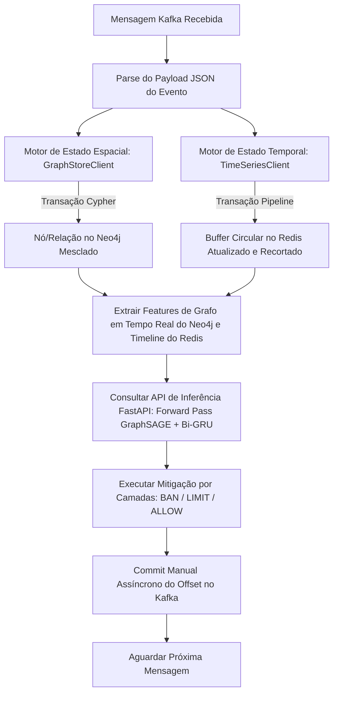

# ⚙️ Processador de Stream BotGuard: Especificações Técnicas

## 1. Visão Geral Arquitetural e Ingestão com Estado

O Processador de Stream BotGuard é um serviço de sincronização de estado e engenharia de features de alta vazão (throughput) e baixa latência. Ele funciona como o pipeline intermediário que traduz eventos brutos de microblogs (ingeridos em tempo real do Apache Kafka) em estados estruturais de alta performance e extrai features lógicas para inferência com aprendizado profundo.

Para viabilizar a classificação por machine learning multimodal (Redes Neurais de Grafos combinadas com Modelos Sequenciais), o processador de stream mantém e consulta concorrentemente duas representações distintas do estado do sistema:

1. **Topologia de Grafo Espacial (Neo4j)**: Representa métricas relacionais de interação (redes de seguidores, cadeias de respostas, retweets). Ele calcula subgrafos locais de 1-hop (ego-graphs) sob demanda.
2. **Sequências Comportamentais Temporais (Redis)**: Representa históricos cronológicos e localizados das ações do usuário, extraindo normalizações de comprimento e sinalizações de complexidade semântica.

### 1.1 Ingestão, Feature-Store e Pipeline de Inferência

O orquestrador opera como um loop de eventos transacional. Ele garante consistência absoluta de estado ao utilizar políticas manuais de commit nos offsets do Kafka, assegurando que o offset de um evento só seja confirmado (committed) no broker depois de ter sido persistido, mapeado em features e avaliado pela API de ML.



---

## 2. Divisão dos Componentes de Infraestrutura

### 2.1 Configuração do Consumidor Kafka

O consumidor é construído utilizando `confluent_kafka`, que encapsula a biblioteca nativa em C de alta performance `librdkafka`.

- **Bootstrap Server**: `localhost:9092`
- **Assinatura do Tópico**: `user_actions`
- **Consumer Group**: `botguard-state-processor`
- **Gerenciamento de Offsets**:
  - `enable.auto.commit = False`: Commits automáticos desativados. Isso garante semântica de entrega do tipo *at-least-once*, evitando perda de dados no caso de falhas no processador de stream ou nos bancos de dados.
  - `auto.offset.reset = earliest`: Inicia automaticamente a leitura a partir do offset mais antigo disponível na partição caso nenhum offset esteja registrado para o grupo.

---

### 2.2 Motor de Banco de Dados de Grafos Espaciais (Neo4j)

O `GraphStoreClient` constrói e mantém a representação viva do grafo espacial de interações. Durante a extração de features, ele compila a vizinhança local de 1-hop e a mapeia diretamente em matrizes esparsas prontas para os modelos downstream do GraphSAGE.

#### 2.2.1 Esquema do Grafo e Ontologias
- **Nós**: Representados pelo rótulo `(:User)`. Cada nó contém:
  - `id`: UUID único do usuário (chave primária).
  - `created_at`: Data e hora da primeira ação simulada.
  - `last_active`: Data e hora da ação simulada mais recente.
- **Relações**: Arestas de interação dinâmicas com propriedades de estado:
  - `[:FOLLOWS]`: Aresta direcionada de $u_{\text{source}}$ para $u_{\text{target}}$.
  - `[:REPLIES_TO]`: Aresta direcionada que representa tópicos de conversa.
  - `[:RETWEETS]`: Aresta direcionada que representa propagação de conteúdo.
  - **Propriedades da Relação**:
    - `count`: Um contador inteiro que rastreia interações acumuladas.
    - `last_interaction`: Data e hora da última interação registrada.

#### 2.2.2 Consulta para Compilação de Subgrafo em Tempo Real
Para realizar a inferência, o GraphSAGE precisa da estrutura de conectividade local do grafo. O cliente executa uma consulta Cypher customizada que busca a vizinhança, calcula os graus globais, aplica escala logarítmica e mapeia as direções das arestas para índices de array:

```cypher
MATCH (target:User {id: $user_id})
OPTIONAL MATCH (target)-[r1]-(neighbor:User)
WITH target, collect(distinct neighbor) + target AS nodes

UNWIND nodes AS n
OPTIONAL MATCH (n)<-[:FOLLOWS]-(follower:User)
WITH nodes, n, count(distinct follower) AS followers_count
OPTIONAL MATCH (n)-[:FOLLOWS]->(following:User)
WITH nodes, n, followers_count, count(distinct following) AS following_count

WITH nodes, collect({
    id: n.id,
    followers: followers_count,
    following: following_count
}) AS node_stats

UNWIND nodes AS source
UNWIND nodes AS target_node
MATCH (source)-[r]->(target_node)
RETURN node_stats, collect(distinct {
    source: source.id,
    target: target_node.id,
    type: type(r)
}) AS edges
```

O cliente transforma esses resultados da seguinte forma:
1. **Mapeamento de Índices**: Associa cada UUID de usuário na vizinhança a um índice inteiro $0 \leq i < K$.
2. **Features Log-Normalizadas**:
   - $\text{log\_followers} = \log(1 + \text{followers})$
   - $\text{log\_friends} = \log(1 + \text{following})$
   - $\text{ratio} = \frac{\text{followers}}{1 + \text{following}}$
   - $\text{log\_ratio} = \log(1 + \text{ratio})$
3. **Matriz de Conectividade (`edge_index`)**: Conecta os índices com base nas arestas do Neo4j, inserindo **auto-loops** (self-loops) para garantir estabilidade na propagação de mensagens da GNN.

---

### 2.3 Motor de Cache Temporal (Redis)

O `TimeSeriesClient` constrói registros cronológicos dos usuários ativos. Ele rastreia as ações temporais e formata as entradas de sequência para o modelo Bi-GRU.

#### 2.3.1 Esquema de Chaves e Estrutura dos Dados
- **Padrão de Chave**: `user_timeline:{user_id}`
- **Estrutura de Armazenamento**: Redis **List (Lista Encadeada)**.
- **Formato do Payload**: Registros JSON enriquecidos, contendo as métricas calculadas em tempo de escrita:
  ```json
  {
    "ts": "2026-05-31T18:45:00.123456Z",
    "type": "REPLY",
    "len_feat": 0.125,
    "is_complex": 1.0
  }
  ```

#### 2.3.2 Engenharia de Features de Leitura e Escrita
- **Na Escrita (`record_action`)**: Calcula a métrica de comprimento do texto normalizada pelo limite do Twitter ($\text{len\_feat} = \min(\text{len}/280, 1.0)$) e sinalizações semânticas ($\text{is\_complex} = 1.0$ se for retweet ou contiver links/hashtags, caso contrário $0.0$).
- **Na Leitura (`get_timeline_features`)**: Recupera as últimas 10 ações do usuário. Se houver menos de 10 registros, aplica preenchimento à direita com vetores `[0.0, 0.0]` (padding) para garantir compatibilidade com as dimensões de entrada da Bi-GRU.

---

## 3. Conexões Científicas: Representação de Features

```
Ação Bruta do Stream
      |
      v
[Processador de Stream]
      |
      +---> Persistência Espacial (Banco de Dados de Grafos Neo4j)
      |         |
      |         +---> Representação da Topologia de Grafos
      |               - Nós: (:User)
      |               - Arestas: [:FOLLOWS], [:REPLIES_TO], [:RETWEETS]
      |               - GNN Downstream: Embeddings Fixados do GraphSAGE k-hop (k=2)
      |
      +---> Persistência Temporal (Fila Circular Redis)
                |
                +---> Representação de Sequência da Linha do Tempo
                      - Buffer circular deslizante das últimas N ações
                      - TTL de 24h para economia de memória ativa
                      - Bi-GRU Downstream: Codificação de Sequência Comportamental
```

---

## 4. Referência de Código Completo

### 4.1 Ponto de Entrada do Orquestrador (`src/stream_processor/main.py`)
```python
import sys
from pathlib import Path

src_path = str(Path(__file__).resolve().parent.parent)
if src_path not in sys.path:
    sys.path.insert(0, src_path)

import json
import logging
from confluent_kafka import Consumer, KafkaError
from stream_processor.infrastructure.neo4j_client import GraphStoreClient
from stream_processor.infrastructure.redis_client import TimeSeriesClient
from stream_processor.infrastructure.ml_client import MachineLearningClient

logging.basicConfig(level=logging.INFO, format="%(asctime)s - %(levelname)s - %(message)s")
logger = logging.getLogger(__name__)

class StreamProcessorOrchestrator:
    def __init__(self, broker_url: str = "localhost:9092", topic: str = "user_actions"):
        self.consumer = Consumer({
            'bootstrap.servers': broker_url,
            'group.id': 'botguard-state-processor',
            'auto.offset.reset': 'earliest',
            'enable.auto.commit': False
        })
        self.topic = topic
        self.consumer.subscribe([self.topic])
        
        self.graph_store = GraphStoreClient()
        self.time_series = TimeSeriesClient()
        self.ml_client = MachineLearningClient()

    def _extract_features(self, user_id: str) -> dict:
        """
        EXTRAÇÃO DE FEATURES DE PRODUÇÃO:
        Consulta o Redis para sequências temporais de ações e o Neo4j para features espaciais do subgrafo local.
        """
        # 1. Busca logs de ações temporais (últimas 10 ações)
        temporal_seq = self.time_series.get_timeline_features(user_id, limit=10)
        
        # 2. Busca a vizinhança local do grafo espacial (ego-graph de 1-hop)
        graph_data = self.graph_store.get_subgraph_features(user_id)
        
        # 3. Monta e retorna o payload completo
        return {
            "user_id": user_id,
            "target_node_idx": graph_data["target_node_idx"],
            "temporal_features": temporal_seq,
            "node_features": graph_data["node_features"],
            "edge_index": graph_data["edge_index"]
        }

    def run_continuously(self):
        logger.info("Iniciando o Processador de Stream integrado à Inferência de ML...")
        try:
            while True:
                msg = self.consumer.poll(1.0)

                if msg is None:
                    continue
                if msg.error():
                    if msg.error().code() == KafkaError._PARTITION_EOF:
                        continue
                    else:
                        logger.error(f"Erro no consumidor Kafka: {msg.error()}")
                        break

                try:
                    payload = json.loads(msg.value().decode('utf-8'))
                    user_id = payload.get('user_id')
                    
                    # 1. Atualiza Bancos de Dados de Estado
                    self.graph_store.update_topology(payload)
                    self.time_series.record_action(payload)
                    
                    # 2. Extrai as Features
                    features = self._extract_features(user_id)
                    
                    # 3. Solicita Inferência do Classificador
                    decision = self.ml_client.evaluate_user(features)
                    
                    if decision:
                        prob = decision.get("bot_probability", 0)
                        action = decision.get("action")
                        needs_review = decision.get("needs_manual_review")
                        
                        # Aplicação das Ações Mitigadoras por Camadas
                        if action == "BAN":
                            logger.warning(f"🚫 [BAN] Usuário {user_id[:8]} bloqueado! (P = {prob:.4f})")
                        elif action == "LIMIT":
                            logger.warning(f"⚠️ [LIMIT] Usuário {user_id[:8]} limitado! (P = {prob:.4f})")
                        else:
                            logger.info(f"✅ [ALLOW] Usuário {user_id[:8]} liberado. (P = {prob:.4f})")
                            
                        if needs_review:
                            logger.info(f"🔍 [REVIEW] Usuário {user_id[:8]} enviado para revisão manual.")
                    
                    self.consumer.commit(asynchronous=True)
                    
                except json.JSONDecodeError:
                    logger.error("Falha ao decodificar payload da mensagem.")
                except Exception as e:
                    logger.error(f"Erro ao processar mensagem: {e}")

        except KeyboardInterrupt:
            logger.info("Processador de Stream parado.")
        finally:
            self.consumer.close()
            self.graph_store.close()

if __name__ == "__main__":
    processor = StreamProcessorOrchestrator()
    processor.run_continuously()
```

### 4.2 Cliente de Integração do Neo4j (`src/stream_processor/infrastructure/neo4j_client.py`)
```python
import logging
from neo4j import GraphDatabase

logger = logging.getLogger(__name__)

class GraphStoreClient:
    def __init__(self, uri: str = "bolt://localhost:7687", auth: tuple = ("neo4j", "botdetection123")):
        self.driver = GraphDatabase.driver(uri, auth=auth)

    def close(self):
        self.driver.close()

    def update_topology(self, action_data: dict):
        action_type = action_data.get("action_type")
        
        if action_type == "POST":
            self._upsert_user(action_data["user_id"], action_data["timestamp"])
        elif action_type in ["REPLY", "RETWEET", "FOLLOW"]:
            self._upsert_interaction(
                source_id=action_data["user_id"],
                target_id=action_data["target_id"],
                action_type=action_type,
                timestamp=action_data["timestamp"]
            )
        else:
            logger.warning(f"Tipo de ação desconhecido para topologia: {action_type}")

    def _upsert_user(self, user_id: str, timestamp: str):
        query = """
        MERGE (u:User {id: $user_id})
        ON CREATE SET u.created_at = $timestamp, u.last_active = $timestamp
        ON MATCH SET u.last_active = $timestamp
        """
        self._execute_write(query, user_id=user_id, timestamp=timestamp)

    def _upsert_interaction(self, source_id: str, target_id: str, action_type: str, timestamp: str):
        if not target_id:
            return

        relationship_map = {
            "REPLY": "REPLIES_TO",
            "RETWEET": "RETWEETS",
            "FOLLOW": "FOLLOWS"
        }
        rel_type = relationship_map.get(action_type)

        query = f"""
        MERGE (source:User {{id: $source_id}})
        ON CREATE SET source.created_at = $timestamp, source.last_active = $timestamp
        ON MATCH SET source.last_active = $timestamp
        
        MERGE (target:User {{id: $target_id}})
        
        MERGE (source)-[r:{rel_type}]->(target)
        ON CREATE SET r.count = 1, r.last_interaction = $timestamp
        ON MATCH SET r.count = r.count + 1, r.last_interaction = $timestamp
        """
        self._execute_write(query, source_id=source_id, target_id=target_id, timestamp=timestamp)

    def _execute_write(self, query: str, **parameters):
        try:
            with self.driver.session() as session:
                session.run(query, parameters)  # type: ignore
        except Exception as e:
            logger.error(f"Falha ao executar query Cypher: {e}")

    def get_subgraph_features(self, target_user_id: str) -> dict:
        """
        Recupera o subgrafo local de vizinhança de 1-hop de target_user_id,
        calcula as features espaciais dos nós (seguidores, seguindo, razão normalizada)
        e formata os índices da matriz edge_index para inferência GNN no PyTorch.
        """
        import math
        
        query = """
        MATCH (target:User {id: $user_id})
        OPTIONAL MATCH (target)-[r1]-(neighbor:User)
        WITH target, collect(distinct neighbor) + target AS nodes
        
        UNWIND nodes AS n
        OPTIONAL MATCH (n)<-[:FOLLOWS]-(follower:User)
        WITH nodes, n, count(distinct follower) AS followers_count
        OPTIONAL MATCH (n)-[:FOLLOWS]->(following:User)
        WITH nodes, n, followers_count, count(distinct following) AS following_count
        
        WITH nodes, collect({
            id: n.id,
            followers: followers_count,
            following: following_count
        }) AS node_stats
        
        UNWIND nodes AS source
        UNWIND nodes AS target_node
        MATCH (source)-[r]->(target_node)
        RETURN node_stats, collect(distinct {
            source: source.id,
            target: target_node.id,
            type: type(r)
        }) AS edges
        """
        
        try:
            with self.driver.session() as session:
                result = session.run(query, user_id=target_user_id)
                record = result.single()
                
                if not record or not record["node_stats"]:
                    return {
                        "target_node_idx": 0,
                        "node_features": [[0.0, 0.0, 0.0]],
                        "edge_index": [[0], [0]]
                    }
                
                node_stats = record["node_stats"]
                edges = record["edges"] or []
                
                id_to_index = {node["id"]: idx for idx, node in enumerate(node_stats)}
                target_node_idx = id_to_index.get(target_user_id, 0)
                
                node_features = []
                for node in node_stats:
                    followers = float(node["followers"])
                    following = float(node["following"])
                    
                    log_followers = math.log1p(followers)
                    log_friends = math.log1p(following)
                    
                    ratio = followers / (following + 1.0)
                    log_ratio = math.log1p(ratio)
                    
                    node_features.append([log_followers, log_friends, log_ratio])
                
                edge_starts = []
                edge_ends = []
                for edge in edges:
                    source_idx = id_to_index.get(edge["source"])
                    target_idx = id_to_index.get(edge["target"])
                    if source_idx is not None and target_idx is not None:
                        edge_starts.append(source_idx)
                        edge_ends.append(target_idx)
                
                # Adiciona auto-loops para garantir conectividade e estabilidade da SAGEConv
                for idx in range(len(node_stats)):
                    edge_starts.append(idx)
                    edge_ends.append(idx)
                
                return {
                    "target_node_idx": target_node_idx,
                    "node_features": node_features,
                    "edge_index": [edge_starts, edge_ends]
                }
                
        except Exception as e:
            logger.error(f"Falha ao recuperar features de subgrafo de {target_user_id}: {e}")
            return {
                "target_node_idx": 0,
                "node_features": [[0.0, 0.0, 0.0]],
                "edge_index": [[0], [0]]
            }
```

### 4.3 Cliente do Cache Redis (`src/stream_processor/infrastructure/redis_client.py`)
```python
import json
import logging
import redis

logger = logging.getLogger(__name__)

class TimeSeriesClient:
    def __init__(self, host: str = "localhost", port: int = 6379, max_history: int = 100):
        self.redis = redis.Redis(host=host, port=port, decode_responses=True)
        self.max_history = max_history

    def record_action(self, action_data: dict):
        user_id = action_data.get("user_id")
        if not user_id:
            return

        key = f"user_timeline:{user_id}"
        
        content = action_data.get("content") or ""
        action_type = action_data.get("action_type") or "POST"
        
        # Calcula as features temporais em tempo real conforme pipeline de treino
        len_feat = min(len(content) / 280.0, 1.0)
        is_complex = 1.0 if (content.startswith("RT @") or "http" in content or "#" in content) else 0.0
        
        event_record = {
            "ts": action_data.get("timestamp"),
            "type": action_type,
            "len_feat": len_feat,
            "is_complex": is_complex
        }
        
        try:
            pipeline = self.redis.pipeline()
            # Insere no início (mais recente primeiro)
            pipeline.lpush(key, json.dumps(event_record))
            # Trunca para manter apenas os N elementos mais novos
            pipeline.ltrim(key, 0, self.max_history - 1)
            # Define o TTL para expirar usuários inativos após 24h
            pipeline.expire(key, 86400) 
            pipeline.execute()
        except redis.RedisError as e:
            logger.error(f"Falha na transação pipeline do Redis: {e}")

    def get_timeline_features(self, user_id: str, limit: int = 10) -> list:
        """
        Busca as últimas 'limit' features temporais de um usuário.
        Preenche a sequência com [0.0, 0.0] se houver menos registros que o limite.
        """
        key = f"user_timeline:{user_id}"
        try:
            records = self.redis.lrange(key, 0, limit - 1)
            features = []
            for r in records:
                data = json.loads(r)
                features.append([
                    float(data.get("len_feat", 0.0)),
                    float(data.get("is_complex", 0.0))
                ])
            # Completa a sequência para compatibilidade de entrada da Bi-GRU
            while len(features) < limit:
                features.append([0.0, 0.0])
            return features
        except redis.RedisError as e:
            logger.error(f"Falha ao buscar linha do tempo no Redis para {user_id}: {e}")
            return [[0.0, 0.0]] * limit
```

---

## 5. Guia de Implantação e Execução

### 5.1 Verificação de Serviços
Antes de iniciar o processador de streams, certifique-se de que os bancos de dados estejam rodando:

1. **Testar conexão com Redis**:
   ```bash
   redis-cli ping
   # Retorno esperado: PONG
   ```
2. **Testar conexão com Neo4j**:
   Acesse o console do Neo4j em `http://localhost:7474` e valide as credenciais `neo4j` / `botdetection123`.

### 5.2 Iniciando o Processador
Execute o motor de processamento diretamente a partir do diretório raiz do workspace:

```bash
# Executado dentro da raiz do projeto (/home/midas/Documentos/AIRTON BRASIL/PROJETOS/botguard)
./venv/bin/python src/stream_processor/main.py
```

### 5.3 Executando os Testes de Integração de Engenharia de Features e Grafos

Duas baterias de testes físicos de integração estão prontas para auditar os mapeamentos e predições.

#### 5.3.1 Testar Extração e Engenharia de Features Relacionais/Temporais
Cria conexões reais de teste de seguidores (A segue B, B segue C, C segue A) e ações, verificando se os cálculos de vizinhança local, grau logarítmico e pad de sequências batem exatamente:
```bash
./venv/bin/pytest -s tests/integration/test_feature_engineering.py
```

#### 5.3.2 Testar Inferência de GNN Físico na GPU
Valida o carregamento dos pesos, conversão de matrizes numéricas para tensores PyTorch e execução de inferência direcionada no CUDA/GPU:
```bash
./venv/bin/pytest -s tests/integration/test_e2e_inference.py
```
